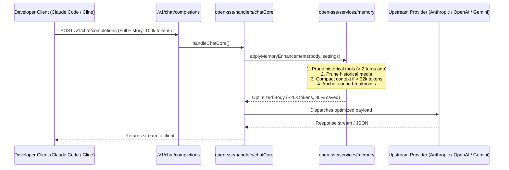

# AI Memory & Token Optimization Architecture

_Last updated: 2026-08-28_

## Overview

The **AI Memory & Token Optimizer** in 9Router introduces modular context and token optimization inspired by [`akitaonrails/ai-memory`](https://github.com/akitaonrails/ai-memory). It targets long-running multi-turn sessions with AI coding agents (Claude Code, Codex, Cline, Roo Code, OpenClaw, Continue) to reduce prompt token consumption by 40%–80% without breaking tool schemas or conversation continuity.

## Core Modules & Phases

### 1. Tool Output Pruning (`open-sse/services/memory/toolPruner.js`)
- **Problem**: Historical tool outputs (`tool_result`, `function_call_output`, file dumps, `git diff`, build logs) accumulate across turns and represent up to 85% of input tokens.
- **Solution**: Retains the full output for the most recent $K$ tool turns (`memoryMaxToolTurnsKeepFull`, default: `2`). Truncates older historical tool results to `memoryMaxHistoricalToolChars` (default: `800` chars), appending a clean truncation notice:
  ```text
  [... Tool output truncated by 9router memory optimizer: 240 lines / 8500 chars omitted ...]
  ```

### 2. Historical Media Pruning (`open-sse/services/memory/mediaPruner.js`)
- **Problem**: Multi-turn image or audio requests re-transmit large Base64 strings on every subsequent turn.
- **Solution**: Replaces historical media blocks that have already been processed and answered by the assistant with lightweight tags (`[Historical image_url omitted by 9router memory optimizer]`), keeping media blocks intact exclusively in the active trailing user turn.

### 3. Sliding Window Context Compaction (`open-sse/services/memory/contextCompactor.js`)
- **Problem**: Extremely long sessions (50+ turns) exceed provider context limits and increase latency.
- **Solution**: When the estimated token count exceeds `memoryCompactionThresholdTokens` (default: `32000`), the compactor preserves the system instruction and the most recent $K$ turns (`memoryRecentTurnsToKeep`, default: `8`), consolidating earlier turns into a structured summary block:
  ```markdown
  [Historical Context Summary by 9router Memory Optimizer]
  Notice: Earlier conversation turns (22 messages) have been compacted to conserve context window.
  Key highlights of earlier conversation:
  - USER: Setup OAuth authentication module
  - ASSISTANT: Generated schema migrations and routes
  ```

### 5. Cross-Session Handoff Store (`open-sse/services/memory/handoffStore.js`)
- **Problem**: Switching between CLI agents (e.g. Claude Code → Codex → Cline) in the same directory loses context.
- **Solution**: Captures bounded session handoffs and injects them into the initial prompt of subsequent sessions when enabled.

## Configuration & Settings

Settings are stored in `db.json` and configurable via both the **Web Dashboard** (`/dashboard/token-saver#memory`) and the **CLI Menu** (`Settings`):

| Setting Key | Type | Default | Description |
|---|---|---|---|
| `memoryToolPruningEnabled` | boolean | `true` | Enable/disable historical tool output pruning |
| `memoryMaxToolTurnsKeepFull` | number | `2` | Number of recent tool turns to keep intact |
| `memoryMaxHistoricalToolChars` | number | `800` | Character limit for older tool outputs |
| `memoryMediaPruningEnabled` | boolean | `true` | Enable/disable historical base64 media pruning |
| `memoryCompactionEnabled` | boolean | `false` | Enable/disable sliding window context compaction |
| `memoryCompactionThresholdTokens` | number | `32000` | Token threshold to trigger compaction |
| `memoryRecentTurnsToKeep` | number | `8` | Recent turns kept uncompacted |
| `memoryHandoffEnabled` | boolean | `false` | Enable/disable cross-session handoff injection |

## Request Flow


