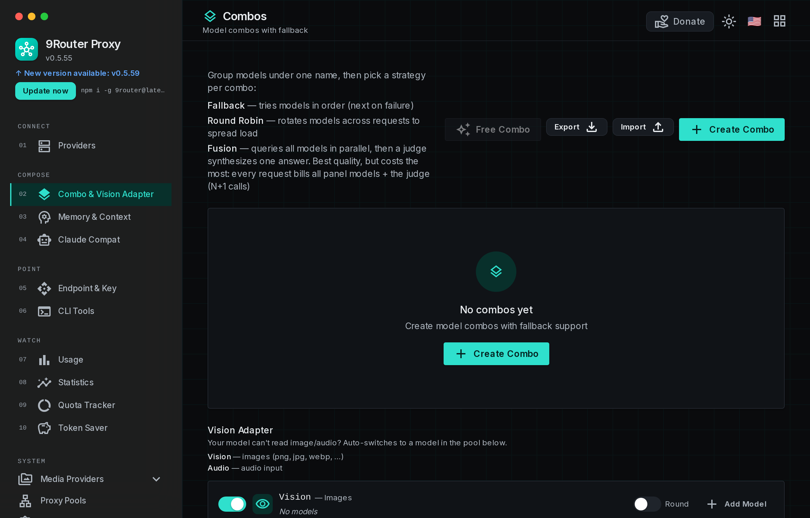

# Getting started

This page covers installing 9Router, the ports it actually listens on, wiring a
CLI tool to it, and the HTTP surface it exposes. Provider-specific setup lives in
[providers.md](providers.md), server deployment in [deployment.md](deployment.md).

## Install

### From npm (recommended)

The launcher is published to npm as `9router`. It installs and supervises the
server and manages the tray icon.

```bash
npm install -g 9router
9router
```

Defaults are `http://localhost:20128/dashboard` for the dashboard and
`http://localhost:20128/v1` for the API. Pass `-p` or `--port` to move it.

```bash
9router --port 30128
```

Node 18 or newer is required by the launcher (`cli/package.json` `engines`).
The published container image is built on `node:22-alpine`.

### From a source checkout

The dashboard and gateway package in this repository is private (`9router-app`),
so a source checkout is the local development path rather than an install
target.

```bash
cp .env.example .env
npm install
npm run dev
```

`npm run dev` and `npm run start` both pass `--port 20127` on the command line,
and an explicit `--port` flag beats the `PORT` environment variable in the
Next.js CLI. A source checkout therefore serves on `http://localhost:20127`, and
setting `PORT` in front of those two scripts does nothing.

To choose the port from source, build once and run the standalone server, which
does read `PORT`:

```bash
npm run build
DATA_DIR=/var/lib/9router PORT=20128 HOSTNAME=127.0.0.1 \
  node .next/standalone/custom-server.js
```

`npm run build` runs a `postbuild` step that copies `public/`, the static chunks
and `custom-server.js` into `.next/standalone/`, so that path is complete. Do not
start the standalone build with a bare `next start`: `custom-server.js` is what
derives the client IP from the TCP socket and strips an attacker-controlled
`X-Forwarded-For`, and bypassing it serves requests unsanitised.

`scripts/dev-test-server.sh up` wraps the same recipe on port 20129 with an
isolated `DATA_DIR`, which is the safe way to try a change without disturbing a
running instance.

### From the container image

See [DOCKER.md](../DOCKER.md) for the image, the volume layout and the
environment variables it honours.

## First login

The dashboard asks for a password on first use. It reads `INITIAL_PASSWORD`,
which defaults to `123456` when the variable is unset and no password hash has
been saved yet. Override it before the instance is reachable from anything other
than loopback.

Session cookies are signed with `JWT_SECRET`. When unset, a secret is generated
once and stored at `$DATA_DIR/jwt-secret`; set it explicitly if several
instances must share sessions.

## Connect a provider and send a request

Open Providers in the dashboard and connect one upstream. The zero-signup
options are Kiro AI, which authenticates through AWS Builder ID, AWS IAM
Identity Center, Google or GitHub, and OpenCode Free, which needs no
authentication at all. Both are described in [providers.md](providers.md).

Then generate an API key in the dashboard and call the endpoint.

```bash
export NINEROUTER_KEY=...   # the key you generated in the dashboard

curl http://localhost:20128/v1/chat/completions \
  -H "Authorization: Bearer $NINEROUTER_KEY" \
  -H "Content-Type: application/json" \
  -d '{
    "model": "kr/claude-sonnet-4.5",
    "messages": [{"role": "user", "content": "hello"}],
    "stream": true
  }'
```

## Addressing models and combos

A model is addressed as `providerPrefix/modelName`, for example
`cc/claude-opus-4-7` for a Claude Code subscription or `glm/glm-4.7` for a GLM
API key. The prefix selects which connection handles the call. The full
catalogue is in [providers.md](providers.md).

A combo is an ordered list of models saved under a name of your choosing. It is
addressed by that name in the `model` field, exactly like a single model, and
9Router walks the list until one entry answers.

```
Name: premium-coding
  1. cc/claude-opus-4-7        subscription primary
  2. glm/glm-5.1               cheap backup
  3. minimax/MiniMax-M2.7      cheapest fallback
```

Fallback triggers on quota exhaustion and on upstream errors. Within one
provider, several accounts can be registered and are rotated before the combo
moves to the next model, so a quota ceiling on one account does not end the
request.

Combos are built by dragging models into order in the dashboard.

<p align="center">
  
</p>

## Wiring a CLI tool

Every tool below speaks to the same base URL and key. Where a tool offers an
"OpenAI compatible" provider type, choose it.

### Cursor

```
Settings > Models > Advanced
  OpenAI API Base URL: http://localhost:20128/v1
  OpenAI API Key:      key from the 9Router dashboard
  Model:               cc/claude-opus-4-7, or a combo name
```

### Claude Code

Edit `~/.claude/config.json`:

```json
{
  "anthropic_api_base": "http://localhost:20128/v1",
  "anthropic_api_key": "<your 9router key>"
}
```

Claude Code filters the model list it fetches from `/v1/models` with a
case-insensitive `claude|anthropic` substring match, so a model whose id carries
neither word does not appear in its picker. The compatibility layer that fronts
non-Claude models behind a `claude-` prefix is described in
[plan-claude-compat-layer.md](plan-claude-compat-layer.md).

### Codex CLI

```bash
export OPENAI_BASE_URL="http://localhost:20128"
export OPENAI_API_KEY="$NINEROUTER_KEY"
codex "your prompt"
```

### OpenClaw

The dashboard can write this for you under CLI Tools. The manual form edits
`~/.openclaw/openclaw.json`:

```json
{
  "agents": {
    "defaults": {
      "model": { "primary": "9router/kr/claude-sonnet-4.5" }
    }
  },
  "models": {
    "providers": {
      "9router": {
        "baseUrl": "http://127.0.0.1:20128/v1",
        "apiKey": "sk_9router",
        "api": "openai-completions",
        "models": [
          { "id": "kr/claude-sonnet-4.5", "name": "Claude Sonnet 4.5 (Kiro Free)" }
        ]
      }
    }
  }
}
```

OpenClaw only reaches a local 9Router. Use `127.0.0.1` rather than `localhost`,
which can resolve to IPv6 and fail to connect.

### Cline, Continue, RooCode, Kilo Code

```
Provider:  OpenAI Compatible
Base URL:  http://localhost:20128/v1
API Key:   key from the 9Router dashboard
Model:     cc/claude-opus-4-7, or a combo name
```

### Others

Icons for the tools known to work are shown in the dashboard. The set currently
includes Claude Code, OpenClaw, Codex, OpenCode, Cursor, Antigravity, Cline,
Continue, Droid, [Zoo Code](https://github.com/Zoo-Code-Org/Zoo-Code), GitHub
Copilot, Kilo Code, OpenDesign, jcode, Grok Build, Devin CLI, DeepSeek TUI and
Qwen Code.

## HTTP surface

The gateway serves the OpenAI shape at `/v1`. Next.js rewrites `/v1/*` onto
`/api/v1/*` internally, which is an implementation detail clients never see.

### Chat completions

```
POST http://localhost:20128/v1/chat/completions
Authorization: Bearer <your 9router key>
Content-Type: application/json

{
  "model": "cc/claude-opus-4-6",
  "messages": [{"role": "user", "content": "Write a function to ..."}],
  "stream": true
}
```

### List models

```
GET http://localhost:20128/v1/models
Authorization: Bearer <your 9router key>
```

The response lists every connected model and every saved combo in OpenAI format.

### Per-request token-saver opt-out

```
X-9Router-Token-Saver: off
```

Any value other than `off` leaves the savers enabled. See
[token-saver.md](token-saver.md) for what each saver does.

### API-only listener

Setting `API_PORT` starts a second listener that serves only `/v1`, `/v1beta`,
`/responses` and `/codex`, and returns 404 for everything else including the
dashboard. `API_HOSTNAME` defaults to `127.0.0.1`. This is the supported way to
expose the API through a tunnel without exposing the dashboard alongside it.

## Community videos

Community walkthroughs, contributed through upstream pull requests:

- [9Router with Claude Code, free setup](https://www.youtube.com/watch?v=raEyZPg5xE0), English, by Build AI With Hamid
- [Claude Code free unlimited setup](https://youtu.be/VQAw612S27Y), Urdu and Hindi, by Build AI With Hamid
- [Claude Code free forever, unlimited models](https://www.youtube.com/watch?v=o3qYCyjrFYg), English, by Build AI With Hamid
- [Claude CLI free setup](https://www.youtube.com/watch?v=Ttpc26m39Dw), English, by CodeVerse Soban
- [Free OpenClaw with Claude Opus](https://www.youtube.com/watch?v=JXmg8_gccgE), English, by Build AI With Hamid
- [Cutting LLM cost for OpenClaw](https://www.youtube.com/watch?v=X69n5Lm06Yw), Vietnamese, by Mì AI
- [OpenClaw free setup end to end](https://www.youtube.com/watch?v=G-5A_D5Pm6Y), Vietnamese, by Mai Gia
- [OpenClaw plus 9Router Zalo bot](https://www.youtube.com/watch?v=hPusYX-5Pmw), Vietnamese, by tuanminhhole
- [GLM with 9Router as Claude Code](https://www.youtube.com/watch?v=WbOEk_pY84M), Vietnamese, by ptit9x
- [Installing 9Router on a MacBook](https://www.youtube.com/watch?v=CfD6OZiPslU), Vietnamese, by ptit9x
- [24 hour coding without rate limits](https://www.youtube.com/watch?v=CkVZZUSTXAI), Indonesian, by Krisswuh
- [Deploying 9Router on Hugging Face](https://www.youtube.com/watch?v=TXGv4eofe1I), Indonesian, by Krisswuh
- [Using any API for AI](https://www.youtube.com/watch?v=GyX-DLvePW8), Persian, by Matin SenPai

## Next

- [providers.md](providers.md) for what to connect and what it costs.
- [oauth.md](oauth.md) for the browser login flows.
- [token-saver.md](token-saver.md) for cutting token spend.
- [troubleshooting.md](troubleshooting.md) when something does not answer.
