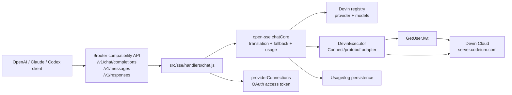
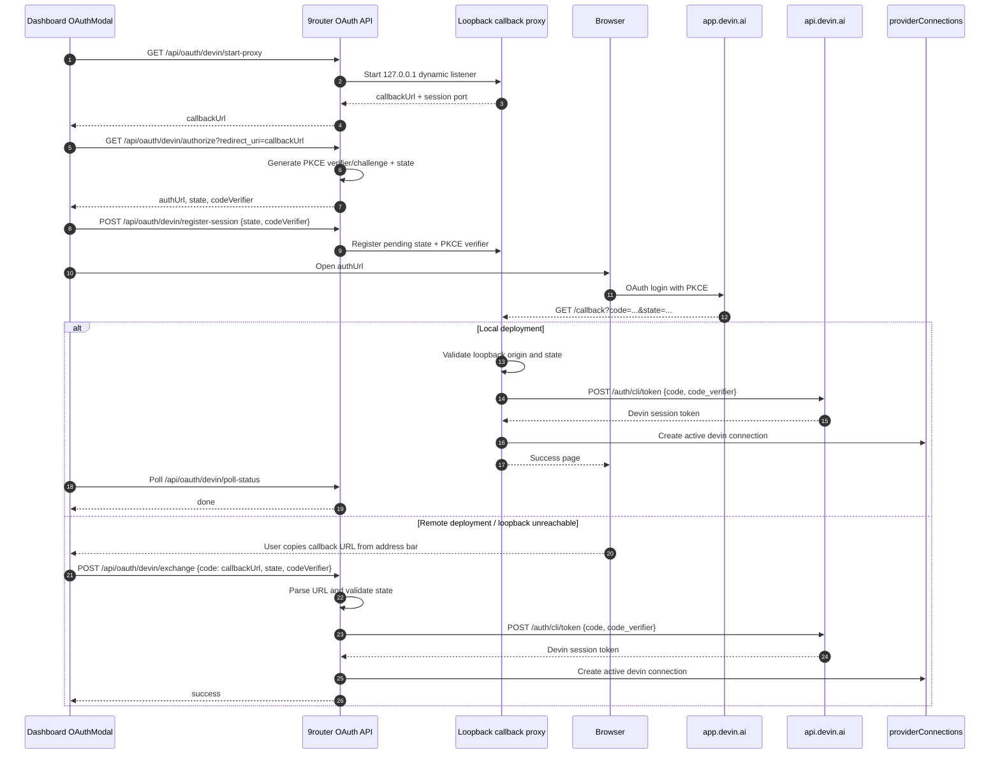
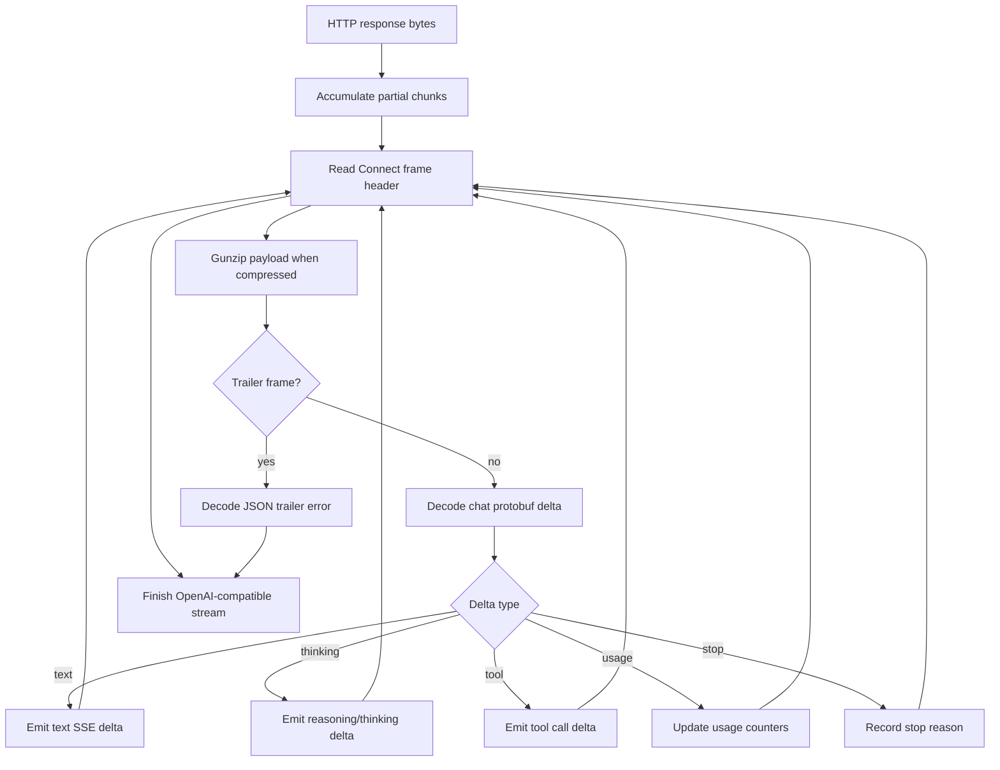

# Devin Cloud Provider for 9router

**Date:** 2026-08-22
**Status:** Design approved for specification review
**Scope:** Devin Cloud provider integration; the existing local `devin-cli` provider remains separate.

## Summary

Add Devin Cloud as a first-class OAuth provider in 9router. The integration will adapt the Devin Cloud protocol used by `pi-devin-provider` into 9router's existing provider, credential, translation, fallback, and streaming pipeline.

The integration has four principal parts:

1. A provider registry entry for Devin and fallback models.
2. A specialized Connect/protobuf executor for Devin Cloud.
3. A Dashboard OAuth flow using PKCE and a server-side loopback callback proxy.
4. Model discovery and protocol-focused unit tests.

The implementation will not reuse the existing `devin-cli` ACP executor or the Windsurf executor. Those providers use different transports and authentication semantics.

## Goals

- Let users connect Devin Cloud from the 9router Dashboard.
- Store Devin OAuth credentials in `providerConnections` using the existing persistence layer.
- Route OpenAI, Anthropic, and other supported client requests through Devin Cloud.
- Preserve streaming text, reasoning/thinking, tool calls, usage, stop reasons, and errors where Devin supplies them.
- Discover account-enabled Devin models dynamically, with safe static fallbacks when discovery is unavailable.
- Reuse 9router's existing account fallback, proxy, request logging, and credential-refresh boundaries.
- Keep the implementation isolated from the existing local `devin-cli` provider.

## Non-goals

- Replacing or modifying the existing `devin-cli` ACP provider.
- Implementing Devin quota/status UI in the first integration.
- Adding a new external dependency for protobuf or Connect; the executor will use the repository's existing Node runtime and small local wire helpers.
- Supporting arbitrary Devin internal RPCs beyond authentication, model discovery, and chat.
- Treating Devin Cloud as an OpenAI-compatible HTTP endpoint.

## Current Context

The source implementation in `pi-devin-provider` uses:

- OAuth PKCE through `https://app.devin.ai`.
- Token exchange at `https://api.devin.ai/auth/cli/token`.
- A session token normalized with the `devin-session-token$` prefix.
- Connect/protobuf calls to `https://server.codeium.com`.
- `GetUserJwt` before chat requests.
- `GetCliModelConfigs` for dynamic model discovery.
- `GetChatMessage` for streaming chat responses.
- Gzip-compressed Connect frames containing protobuf payloads.

9router already provides:

- Registry-driven provider metadata and models.
- Specialized executors for non-standard upstream protocols.
- A generic OAuth provider abstraction.
- Dynamic loopback callback proxies for providers such as Windsurf, Trae, and Zed.
- Shared connection persistence and account fallback.
- Translation from multiple client formats into an internal provider request.

## Architecture



### Provider boundary

The provider registry will expose Devin as `devin`, with a short alias such as `dv`. The existing `devin-cli` registry entry remains hidden and unchanged.

The registry transport will declare an internal OpenAI target format so the normal translation pipeline can produce a predictable intermediate body. The specialized executor will ignore the JSON transport URL and encode the translated body into Devin's protobuf wire format.

### New or modified files

Expected files:

```text
open-sse/providers/registry/devin.js
open-sse/providers/registry/index.js              # generated import/list update
open-sse/executors/devin.js
open-sse/executors/index.js                       # executor registration
src/lib/oauth/constants/oauth.js
src/lib/oauth/providers/devin.js
src/lib/oauth/providers/index.js
src/lib/oauth/utils/server.js                     # Devin callback proxy/session
src/app/api/oauth/[provider]/[action]/route.js    # Devin proxy routing
src/app/api/providers/[id]/models/route.js        # Devin discovery branch
src/shared/components/OAuthModal.js               # Dashboard OAuth UX routing

tests/unit/devin-protocol.test.js
tests/unit/devin-executor.test.js
tests/unit/devin-oauth.test.js
```

The exact file set may be reduced if an existing generic path supports the behavior without provider-specific branching. No unrelated refactor is part of this design.

## OAuth Flow

The Dashboard will use a server-side loopback proxy. Devin requires the exact registered callback URI `http://127.0.0.1:59653/callback`, so the Devin listener uses that fixed port and path rather than a dynamic callback.

The flow has two deployment modes:

- **Local deployment:** when the browser and 9router process are on the same machine, the loopback callback reaches the proxy and completes automatically.
- **Remote deployment:** when the Dashboard is opened from a different machine, `127.0.0.1` in the callback URL refers to the user's machine rather than the 9router server. The callback may therefore show a connection-failed page, but the complete URL remains in the browser address bar. The user can copy that URL and paste it into the OAuth modal. The server extracts the `code` and `state`, retrieves the server-side PKCE verifier for that login session, validates state, and completes the exchange.

The pasted value is a short-lived, single-use authorization callback URL—not an access token. It must never be logged or displayed after exchange. A public HTTPS callback endpoint may be added later only when the deployment has a trusted external origin and Devin accepts that redirect URI.



### OAuth credential mapping

The connection will store the token in the existing `accessToken` field. The token will not be stored in `refreshToken`: it is not a refresh token in the OAuth sense and must not be sent to a generic refresh grant. Because Devin tokens are long-lived/opaque in the current contract, the initial connection will use `expiresAt: null`; the executor will rely on upstream authentication errors rather than proactively treating the token as expired.

The OAuth modal must treat Devin as a callback-URL provider using the exact `http://127.0.0.1:59653/callback` redirect URI. In remote/manual mode it must accept the complete pasted callback URL, not only a raw authorization code, and submit it to the same exchange endpoint. The exchange endpoint must parse the URL without logging its query string.

Recommended mapping:

```js
{
  provider: "devin",
  authType: "oauth",
  accessToken: "<opaque Devin CLI token>",
  refreshToken: null,
  expiresAt: null,
  providerSpecificData: {
    authMethod: "oauth",
    apiEndpoint: "https://api.devin.ai",
    webEndpoint: "https://app.devin.ai"
  },
  testStatus: "active"
}
```

No generic token refresh or local expiry heuristic will be added in this version. If Devin later documents a refresh-token contract, it can be added as a provider-specific refresh implementation.

## Devin Wire Protocol

### Authentication request

Before a chat request, the executor calls:

```text
POST https://server.codeium.com/exa.auth_pb.AuthService/GetUserJwt
Content-Type: application/proto
Connect-Protocol-Version: 1
Accept: */*
```

The request is a protobuf message containing Devin metadata and the normalized session token. The response is decoded as protobuf and the first string field containing the user JWT is extracted.

### Chat request

```text
POST https://server.codeium.com/exa.api_server_pb.ApiServerService/GetChatMessage
Content-Type: application/connect+proto
Connect-Protocol-Version: 1
Connect-Content-Encoding: gzip
Accept-Encoding: identity
Connect-Accept-Encoding: gzip
```

The request body is:

1. Devin metadata with the normalized session token and user JWT.
2. Optional system prompt.
3. Repeated prompts converted from the translated OpenAI-style messages.
4. Generation configuration.
5. Tool declarations.
6. Cascade/session ID, request ID, and selected model ID.

The body is gzip-compressed and wrapped in a Connect frame:

```text
+--------+----------------------+-------------------+
| flags  | payload length u32   | gzip protobuf     |
| 1 byte | big-endian, 4 bytes  | payload           |
+--------+----------------------+-------------------+
```

### Response decoding



The parser must tolerate frames split across multiple TCP reads and must reject oversized or malformed lengths before allocation or decompression. The executor must close the response stream after emitting the final error or done event.

## Request and Response Semantics

### Request conversion

The normal 9router translator produces an OpenAI-style intermediate request. The executor will convert:

- `system` content to Devin's system prompt field.
- user and assistant text to Devin prompt entries.
- assistant tool calls to Devin wire tool-call entries.
- tool results to Devin tool-result entries.
- OpenAI tools to Devin tool declarations.
- `max_tokens` and `temperature` to Devin generation configuration.
- the resolved upstream model ID to Devin's model field.

Images and unsupported content will follow the existing capability filtering. The initial Devin registry will declare text-only input unless discovery confirms a model supports images.

### Response conversion

The executor will return an OpenAI-compatible SSE `Response` to the existing `chatCore` response handling path. It will map:

- text deltas to assistant content chunks
- thinking deltas to the internal reasoning representation
- tool deltas to OpenAI tool-call chunks
- usage deltas to `prompt_tokens`, `completion_tokens`, and cache fields where available
- Devin stop values to `stop`, `length`, or `tool_calls`
- trailer errors to the existing provider error parser

If Devin sends a complete tool call in one delta, the executor will emit it as a complete tool call. If it sends incremental JSON, the executor will accumulate JSON by tool-call ID and emit only the incremental argument text, matching the existing stream conventions.

## Model Discovery

### Static fallback

The registry will contain at least:

```text
swe-1-7  -> SWE-1.7
swe-1-6  -> SWE-1.6
```

### Dynamic endpoint

The Dashboard provider-model endpoint will add a Devin-specific branch that calls:

```text
POST https://server.codeium.com/exa.api_server_pb.ApiServerService/GetCliModelConfigs
Content-Type: application/proto
Connect-Protocol-Version: 1
```

The response parser will:

- support uncompressed and gzip-compressed protobuf payloads
- read enabled model configurations
- use the Devin model ID and display name
- derive context length with a safe default
- cap max output tokens to the existing runtime limit
- mark reasoning models based on the model metadata/name
- preserve text/image capability flags when supplied
- fall back to static registry models on timeout, malformed response, or upstream failure

Discovery is an explicit user action or connection-page refresh, not a mandatory step for every chat request.

## Error Handling and Fallback

| Failure | Behavior |
|---|---|
| Missing credential | Existing 9router provider-unavailable response |
| OAuth state mismatch | Reject callback, mark session failed, do not persist credentials |
| OAuth token exchange failure | Show OAuth failure and keep no connection |
| `GetUserJwt` non-2xx | Return a provider authentication error; account fallback may try another Devin account |
| Chat non-2xx | Return upstream status/body through standard executor error handling |
| Invalid Connect frame | Fail the current stream with a provider error; never loop indefinitely |
| Trailer error | Emit one normalized provider error and close the stream |
| Model discovery timeout | Return static model fallback with a warning where the API supports warnings |
| Token expiry | Do not invoke a generic OAuth refresh grant; require a new OAuth login unless Devin provides a refresh mechanism later |
| Client disconnect | Abort the upstream request through the existing stream controller |

The executor must not log access tokens, user JWTs, OAuth codes, raw callback URLs, or raw upstream response bodies.

## Security

- Validate OAuth `state` before exchanging a code.
- Accept callbacks only on `127.0.0.1` and reject non-loopback `Origin` headers.
- Keep PKCE verifier and OAuth state server-side until exchange completes. The registration request may carry the verifier in a POST body; it must never be placed in a URL or query string.
- Support manual callback URL paste when the browser cannot reach a loopback proxy on a remote deployment.
- Treat pasted callback URLs as secrets: redact them from logs and do not persist them after exchange.
- Redact token-bearing query parameters and request headers from logs.
- Bound protobuf frame sizes before decompression.
- Avoid dynamic URLs from Devin responses; upstream hosts remain allowlisted constants.
- Do not reuse the Windsurf or Devin CLI credential fields in a way that could cause accidental cross-provider token injection.
- Do not add a generic token refresh handler for Devin until the upstream contract provides a real refresh token.

## Testing Strategy

### Protocol tests

`tests/unit/devin-protocol.test.js` will test:

- session-token prefix normalization
- protobuf varint and length-delimited encoding
- metadata and chat request construction
- gzip Connect frame construction and parsing
- split/incomplete frame handling
- oversized frame rejection
- text, thinking, tool, usage, stop, and trailer decoding
- malformed protobuf handling

### Executor tests

`tests/unit/devin-executor.test.js` will test:

- executor registration and provider identity
- `GetUserJwt` followed by `GetChatMessage`
- required Connect headers
- gzip-framed request body
- streaming conversion to OpenAI SSE
- tool-call accumulation
- usage mapping
- non-2xx and trailer error behavior
- abort propagation
- credential field selection

### OAuth tests

`tests/unit/devin-oauth.test.js` will test:

- PKCE challenge generation and URL parameters
- callback path and state validation
- token exchange request shape
- JWT expiry extraction and opaque-token fallback
- provider registration and OAuth metadata
- callback proxy session lifecycle

All tests will use injected/mock fetch functions and local buffers. No live Devin account or network access is required.

## Operational Notes

- The provider should initially be visible in the Dashboard because the requested feature is Dashboard OAuth onboarding.
- The existing `devin-cli` provider remains hidden and continues to use local ACP subprocess execution.
- Provider registry imports must be regenerated using the repository's registry generation convention rather than hand-editing generated content where applicable.
- The implementation should avoid adding quota/status UI until the core authentication and chat path is stable.

## Acceptance Criteria

1. `devin` appears as an OAuth provider in the Dashboard.
2. A user can complete Devin OAuth and create an active provider connection.
3. `/v1/models` includes the static Devin fallback models when a connection exists.
4. Devin model discovery replaces the fallback catalog when the upstream responds successfully.
5. A text chat request reaches Devin Cloud and streams back through 9router.
6. Thinking, tool calls, usage, and upstream errors are mapped without breaking the existing client formats.
7. An expired or invalid token produces a clear authentication error without a fake generic refresh attempt.
8. The existing `devin-cli` path and all unrelated providers remain unchanged.
9. Protocol, executor, and OAuth tests pass without network credentials.
10. Provider baseline verification reports no unrelated provider regression.
