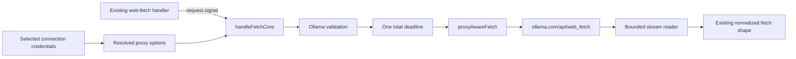

# Ollama Cloud Web Fetch Adaptation

**Date:** 2026-08-30
**Status:** Approved umbrella design. Only Subproject 1, Transport, is implementation-ready.
**Source:** Adapt upstream PR #3624 without applying its raw patch.

## Decision

Add Ollama Cloud web fetch as three serially reviewed subprojects. The first subproject adds a bounded Ollama adapter through 9router's existing proxy-aware transport. It does not publish Ollama as a web-fetch provider and does not make the feature reachable from the public API.

The complete feature is not done when Transport lands. Public discovery, UI, account pinning, capability-specific persisted state, and fallback classification require their own approved specifications and green gates before release.

The official upstream contract used by this design is [Ollama's Web Fetch API](https://docs.ollama.com/capabilities/web-search#web-fetch-api). It is a `POST` to `https://ollama.com/api/web_fetch`, authenticated with a Bearer API key, with JSON body `{ "url": "<target>" }`. A successful response contains `title`, `content`, and `links`.

## Goals

- Add an Ollama adapter to the existing web-fetch core without bypassing per-connection proxy, pool, relay, `NO_PROXY`, or `strictProxy` behavior.
- Apply one end-to-end deadline across connection, response headers, and bounded body consumption.
- Reject invalid configuration, credentials, URLs, formats, and character limits before network access.
- Bound every upstream response before parsing and every returned link before normalization.
- Preserve caller abort ownership and reason through the proxy and response-body paths.
- Keep all existing Firecrawl, Jina Reader, Tavily, and Exa behavior unchanged.
- Give the later public-contract and state owners a narrow, non-conflicting transport result.

## Non-goals

- Applying or cherry-picking PR #3624 unchanged.
- Adding `webFetch` to the Ollama registry in the Transport subproject.
- Publishing or accepting `ollama/fetch` in the Transport subproject.
- Changing model discovery, model-info metadata, the dashboard, examples, copied commands, or account pinning.
- Changing `getProviderCredentials`, `markAccountUnavailable`, `clearAccountError`, connection persistence, chat status, chat backoff, or chat model locks.
- Deciding whether an upstream 403, 404, empty 200, or quota response is destination-scoped, account-scoped, or provider-scoped.
- Refactoring the other web-fetch providers onto the new Ollama transport seam.
- Adding dependencies, schema migrations, generated artifacts, bundled-skill changes, or live quota probes.

## Umbrella decomposition

The implementation order follows the security review. Each subproject has a separate review boundary.

| Order | Subproject | Owned behavior | Release boundary |
|---:|---|---|---|
| 1 | Transport | Official Ollama HTTP contract, injected proxy-aware transport, total deadline, bounded body and links, local validation | Fully specified below. It remains unreachable because the registry is unchanged. |
| 2 | Public contract | Ollama registry, `ollama/fetch` normalization, `/v1/models/web`, `/v1/models/info`, provider UI, format controls, copied request, account pinning | Requires `2026-08-30-ollama-cloud-web-fetch-public-contract-design.md`. It must not expose production traffic before Subproject 3 is green. |
| 3 | State and fallback | Capability-specific status, backoff, and lock state; deterministic request, destination, auth, entitlement, quota, and transport policy | Requires `2026-08-30-ollama-cloud-web-fetch-state-fallback-design.md`, reconciled with the provider-scoped selection queue from PR #3629. |

Documentation and `skills/9router-web-fetch` are updated only after all three subprojects pass their gates. If Subproject 2 cannot remain disabled behind an existing release mechanism, Subprojects 2 and 3 must integrate atomically. A partially reachable feature is not an acceptable intermediate release.

## Approaches considered

### 1. Apply the upstream adapter with global `fetch`

This is rejected. It sends the Ollama request outside the selected connection's proxy and relay policy. Under `strictProxy`, a failed proxy can become a direct disclosure of the target URL to Ollama. Its timeout ends at response headers, its body read is unbounded, its advertised format and maximum are not enforced, and its missing-key path sends an unauthenticated request.

### 2. Refactor every fetch provider onto one new transport abstraction

This could improve the entire fetch subsystem, but it is rejected for the first subproject. Firecrawl, Jina Reader, Tavily, and Exa have distinct request and response behavior plus existing compatibility tests. Migrating them together would enlarge the regression surface and make Ollama's security properties harder to review.

### 3. Add a bounded Ollama adapter with an injected transport

This is the selected approach. `handleFetchCore` gains optional `signal`, `transport`, and `proxyOptions` inputs. Only the new Ollama branch consumes them. The application handler passes the caller signal and proxy options already resolved for the selected connection. Production defaults to `proxyAwareFetch`; focused tests inject a deterministic transport.

This approach preserves the current provider architecture, makes network policy explicit, and leaves a later general fetch refactor possible without requiring it now.

## Current constraints

The existing application boundary in `src/sse/handlers/fetch.js` already enforces the configured inbound 9Router API key and runs `assertPublicUrl` before credential selection. It currently passes neither `request.signal` nor resolved connection proxy settings into the provider-agnostic core.

The current core in `open-sse/handlers/fetch/index.js` uses global `fetch`. Its timer is cleared as soon as response headers arrive, and `res.json()` or `res.text()` can then read indefinitely. Its current `maxCharacters` behavior treats zero or a missing value as unlimited. Those legacy semantics remain unchanged for existing providers in this subproject.

`getProviderCredentials` already resolves these fields under `credentials.providerSpecificData`.

| Field | Transport meaning |
|---|---|
| `connectionProxyEnabled` | Enables the selected connection or pool proxy. |
| `connectionProxyUrl` | Carries the resolved proxy identity. |
| `connectionNoProxy` | Preserves the connection-specific bypass list. |
| `vercelRelayUrl` | Routes the Ollama API call through the existing relay. |
| `strictProxy` | Forbids a direct Ollama attempt after proxy failure. |

The target page itself is fetched by Ollama Cloud. The proxy policy governs 9router's connection to `ollama.com`; it does not provide DNS pinning or redirect control for Ollama Cloud's remote page fetch. No response link is dereferenced by 9router.

## Transport architecture



Subproject 1 changes no registry metadata. Normal route resolution therefore continues to reject Ollama as a web-fetch provider. Focused tests reach the adapter through `handleFetchCore` with an explicit Ollama configuration fixture.

## Transport interface

`handleFetchCore` retains its current result shape and gains these optional inputs.

```js
handleFetchCore({
  url,
  format,
  maxCharacters,
  provider,
  providerConfig,
  credentials,
  signal,
  proxyOptions,
  transport,
  log,
})
```

`transport` has the same call shape as `proxyAwareFetch`.

```js
transport(url, requestInit, proxyOptions) -> Promise<Response>
```

Production uses `proxyAwareFetch` when no transport is injected. Tests inject the seam directly. No module-global fetch replacement is added.

The application handler builds `proxyOptions` from the refreshed credentials using the five fields in the previous table and passes `request.signal` in both authenticated and no-auth calls. It does not change credential selection, account pinning, fallback, or persisted state.

The Ollama branch fails closed when its `providerConfig` does not declare all three expected values.

| Setting | Required Transport value | Semantics |
|---|---:|---|
| `formats` | `["markdown"]` | Omitted or `null` request format selects the first entry. Every other value is a local 400. Matching is exact and case-sensitive. |
| `maxCharacters` | `200000` | Omitted or `null` request value selects the cap. Accepted values are integers from 1 through 200000. Zero, negative, fractional, string, non-finite, and over-cap values are local 400 errors. |
| `timeoutMs` | `30000` | One absolute deadline covers transport, headers, and the complete bounded body read. |

Missing or inconsistent Ollama configuration produces a local 500 and makes zero transport calls. These values become registry-owned in Subproject 2; Transport does not add the registry entry itself.

## Request validation and construction

Validation completes before the transport is invoked.

1. `url` must be a non-empty string with no leading or trailing whitespace.
2. The UTF-8 representation of `url` must be at most 8192 bytes.
3. The parsed protocol must be `http:` or `https:`.
4. Username and password components are forbidden.
5. The application boundary continues to enforce `assertPublicUrl` for private literals and internal host forms.
6. The format and maximum must satisfy the table above.
7. `credentials.apiKey` must be a non-empty trimmed string of visible ASCII characters with no whitespace or control characters. Other token fields are not substitutes for an Ollama API key.

The 8192-byte URL limit is a local safety policy because the official API publishes no URL-size bound. It limits request amplification while accommodating ordinary signed public URLs.

The outbound request is exact.

```http
POST /api/web_fetch HTTP/1.1
Host: ollama.com
Authorization: Bearer <trimmed Ollama API key>
Content-Type: application/json
Accept: application/json

{"url":"https://example.com/page"}
```

No format, character limit, provider name, connection ID, proxy credential, or 9router API key is added to the body. The adapter never writes the target URL or Ollama API key to error logs. Authorization values are redacted from any caught transport message before logging or returning it.

## Abort and deadline semantics

One owned deadline begins immediately before the transport call and remains active until the response body is completely consumed or canceled. The timer is cleared in one final cleanup path after body processing, never when headers arrive.

- A caller signal that is already aborted prevents any network attempt.
- A later caller abort preserves `request.signal.reason`, cancels the response reader when present, and returns a transport result with status 499.
- An owned 30-second deadline aborts the same request and reader and returns status 504.
- A non-abort transport failure returns 502 with a bounded, redacted message.
- The body loop races each `reader.read()` against the composed signal. This prevents a mock, relay, or nonconforming stream from hanging after abort.
- `reader.cancel(reason)` is best-effort and rejection-owned. Cleanup failure cannot create an unhandled rejection or replace the primary result.

Caller abort takes precedence when the caller signal is already aborted or is the first observed source. The owned timeout takes precedence only when its timer is the first observed source. The same classification applies before headers and during body consumption.

## Bounded response handling

The adapter never calls unbounded `response.json()` or `response.text()`.

| Bound | Value | Behavior on violation |
|---|---:|---|
| Successful response body | 4 MiB | Cancel the reader and return 502. |
| Error response body used for diagnostics | 16 KiB | Cancel the remainder, preserve the upstream status, and use a generic bounded message. |
| Returned link count | 100 | Treat the successful upstream response as malformed and return 502. |
| Aggregate returned link bytes | 64 KiB | Treat the successful upstream response as malformed and return 502. |
| Each returned link | 8192 UTF-8 bytes | Treat the successful upstream response as malformed and return 502. |

`Content-Length` larger than the applicable bound fails before reading, but the streamed byte count remains authoritative when the header is absent, invalid, or understated. UTF-8 decoding is fatal. Invalid encoding, invalid JSON, arrays, primitives, and missing required fields are 502 protocol failures.

A successful response must use `application/json` or an `application/*+json` media type and decode to a plain object with string `title` and string `content`. Empty strings are valid. `links` may be absent; when present it must be an array whose members all satisfy these rules.

- Each link is a string URL using `http:` or `https:`.
- Each link has no leading or trailing whitespace.
- Link username and password components are forbidden.
- Links are preserved in upstream order and are not followed, fetched, normalized to a different host, or made trusted.
- Any invalid element fails the response. Silent filtering is avoided because it can make a malformed upstream response look authoritative.

The content is truncated to the requested maximum before `buildData`. The maximum follows the existing response's UTF-16 length convention, but truncation must not leave a dangling high surrogate at the boundary. `content.length` therefore remains compatible with the existing normalized shape and never exceeds the accepted maximum. The optional top-level `links` field is added only when at least one validated link exists. `usage.fetch_cost_usd` remains `null` because no stable cost contract is published.

The 4 MiB wire cap accommodates 200000 UTF-16 code units even when JSON uses Unicode escape sequences, plus the body-bounded title and explicitly bounded links, while preventing unbounded materialization.

## Transport result and error boundary

The first subproject preserves the existing result envelope.

```js
{ success: true, data }
{ success: false, status, error, code? }
```

Adapter-local `code` values make deterministic tests possible without deciding fallback scope. They distinguish request validation, missing credentials, timeout, caller abort, proxy or transport failure, oversized body, invalid content type, invalid JSON, empty object, and invalid response shape. Error strings are bounded to 512 characters and contain neither credentials nor the target URL.

For an upstream non-2xx response, Transport preserves the HTTP status and extracts only a bounded scalar `error`, `message`, or `detail` field from JSON. Otherwise it uses `Ollama web fetch failed (HTTP <status>)`. It does not label the failure as destination, account, entitlement, quota, or provider failure. It does not parse retry headers into persisted state.

An HTTP 200 empty object receives a distinct adapter-local code rather than being silently accepted. Subproject 3 owns the policy that may map the known empty-quota response to quota exhaustion. Until then, the adapter returns a 502 protocol failure and remains unreachable publicly.

## Deferred interface contracts

### Subproject 2, Public contract

The later public-contract specification owns these decisions and files.

- Add `webFetch` and the exact format, maximum, timeout, and unknown cost to `open-sse/providers/registry/ollama.js` without removing current chat models or `thinkingFormat`.
- Make the ID returned by `/v1/models/web` directly invocable at `/v1/web/fetch`.
- Accept canonical `ollama/fetch` and the backward-compatible unsuffixed `ollama` alias without sending a fake `fetch` model through chat parsing.
- Correct `/v1/models/info` metadata from `/v1/fetch` to `/v1/web/fetch`.
- Drive the dashboard format selector and maximum from the registry rather than hardcoded Markdown, text, HTML, and zero.
- Read and honor `x-connection-id` through `preferredConnectionId`.
- Keep routine discovery non-spending. `/api/tags` may show configuration presence, but it cannot claim web-fetch entitlement or quota readiness.

### Subproject 3, State and fallback

The later state specification owns all account and persistence policy.

- Store web-fetch status, backoff, and lock state independently from chat state.
- Keep the integrated provider-keyed selection queue from PR #3629. A capability state key must not replace or weaken its cross-account serialization.
- Ensure fetch success clears only fetch state and chat success clears only chat state.
- Classify request, destination, authentication, entitlement, quota, rate-limit, upstream, timeout, and proxy failures before deciding rotation or combo fallback.
- Ensure destination 403 and 404 failures do not rotate Ollama keys by default.
- Define empty-200 quota behavior and safe `Retry-After` or reset handling.
- Prove rollback cleanup against real isolated persistence.

Neither later owner may replace the transport with direct `fetch`, remove the total body deadline, accept unbounded content, or weaken `strictProxy` behavior.

## Ownership

Subproject 1 has exclusive implementation ownership of these paths.

```text
open-sse/handlers/fetch/index.js
src/sse/handlers/fetch.js
tests/unit/ollama-web-fetch-transport.test.js
```

Changes to `src/sse/handlers/fetch.js` are limited to building the existing proxy-options shape and passing `request.signal` and `proxyOptions` into the core. The core owns the production `proxyAwareFetch` default; only tests inject another transport. No selection, fallback, auth-state, combo, model normalization, or account-pinning code belongs in this subproject.

Adjacent tests may be executed but not edited unless ownership is explicitly broadened. The implementation does not touch registry files, auth services, repositories, migrations, model routes, dashboard components, skills, dependencies, lockfiles, or generated files.

## Strict TDD gates for Transport

Production code changes begin only after the focused test file fails for the intended missing behavior. Patch-text assertions and tests that only restate mock arguments do not satisfy RED.

The focused suite must prove these observable behaviors.

1. The exact endpoint, method, Bearer header, content type, accept header, and byte-exact `{ url }` body reach the injected transport.
2. Missing, whitespace-only, non-ASCII, and control-character Ollama keys fail before the transport and never appear in logs or errors.
3. Missing or inconsistent provider configuration fails closed with no network call.
4. Only Markdown is accepted. Omitted and `null` format default to Markdown. Text, HTML, case variants, arrays, and non-strings fail locally.
5. Omitted and `null` maximum default to 200000. One and 200000 pass. Zero, negative, fractional, string, non-finite, and 200001 fail locally.
6. URL tests cover missing input, surrounding whitespace, malformed values, unsupported schemes, embedded credentials, the 8192-byte boundary, and one byte over it. Existing app-level private-literal tests remain green.
7. Exact direct, per-connection proxy, pool-resolved proxy, relay, `NO_PROXY`, and `strictProxy` options reach `proxyAwareFetch` without mutation.
8. A strict proxy failure makes zero direct Ollama attempts. Non-strict behavior remains the existing `proxyAwareFetch` contract.
9. Caller abort is proven before headers and during a never-ending body. The original reason is preserved, the reader is canceled once, and no timer or abort listener remains.
10. The 30-second deadline is tested with fake timers for slow headers, slow body, and a reader that never resolves. It maps to 504 and cancels the reader.
11. `Content-Length` and streamed-count tests cover exact 4 MiB, one byte over, missing header, understated header, multibyte UTF-8, invalid UTF-8, invalid JSON, wrong content type, empty object, missing fields, and empty string content.
12. Link tests cover missing and empty lists, 100 valid entries, 101 entries, exact and over aggregate bytes, non-string values, non-HTTP schemes, embedded credentials, order preservation, and zero dereferences.
13. Truncation tests cover the default, exact maximum, over-maximum content, and a surrogate pair at the cut boundary.
14. Non-2xx tests prove bounded JSON and text errors, preserved HTTP status, generic over-bound errors, redaction, and no target URL echo.
15. Existing Firecrawl, Jina Reader, Tavily, and Exa request and normalized-response fixtures remain unchanged.

Required focused and adjacency commands are run from the isolated worktree.

```bash
(cd tests && npx vitest run \
  unit/ollama-web-fetch-transport.test.js \
  unit/strict-proxy-propagation.test.js \
  unit/proxy-fetch-mitm-abort.test.js \
  unit/firecrawl-selfhosted.test.js \
  unit/jina-reader-fetch.test.js)

node --check open-sse/handlers/fetch/index.js
node --check src/sse/handlers/fetch.js
npx eslint open-sse/handlers/fetch/index.js src/sse/handlers/fetch.js tests/unit/ollama-web-fetch-transport.test.js
npm run build

(cd tests && npx vitest run --reporter=json --outputFile=/tmp/task6-pr3624-vitest.json)
node tests/__baseline__/verify-no-regression.mjs /tmp/task6-pr3624-vitest.json
```

The test receipt must record the initial RED failure and final GREEN result separately. A skipped test, unavailable dependency, baseline exception, or unrelated suite failure is reported as such and is not converted into a pass.

## Security invariants

- The Ollama API key exists only in the Authorization header and the existing encrypted connection record.
- The outbound request always uses the fixed HTTPS Ollama endpoint.
- The selected connection's proxy identity is preserved. `strictProxy` never falls back to direct Ollama traffic.
- Caller abort and timeout cover body consumption, not only response headers.
- No unbounded body, error body, content string, or link list reaches JSON parsing or the client.
- No returned link is trusted or dereferenced.
- URL userinfo is rejected before the target URL can cross the provider boundary.
- The remote-fetch architecture is described honestly. Local DNS pinning does not govern Ollama Cloud's page retrieval.
- Transport never mutates account, capability, chat, or dashboard state.

## Rollout and rollback boundary

Transport alone has no runtime rollout because the Ollama registry remains unchanged. Its commit may be reverted without data migration, credential changes, or persisted-state cleanup.

The complete feature requires an isolated runtime smoke only after all three subprojects are integrated. A live Ollama smoke is optional when a dedicated test key and quota approval exist. Production credentials and unapproved quota are not used. Public docs must not claim support before discovery-to-invocation, state isolation, proxy, auth, UI, build, and runtime gates are green.

## Rejected behavior

- Direct or module-global transport bypass.
- A fake `ollama/fetch` chat model or generic chat-model parsing.
- Clearing the timeout after headers.
- `response.json()` or `response.text()` on an unbounded body.
- Zero as an unlimited Ollama maximum.
- Shared chat status, backoff, or lock fields for web fetch.
- Account rotation for unclassified destination failures.
- A UI account selector whose header is ignored.
- Discovery or documentation that claims quota readiness without a real, authorized runtime request.
- Unrelated PR #3624 hunks or opportunistic fetch-provider refactors.

## Acceptance boundary

Subproject 1 is complete only when its owned diff is limited to the three paths above, the deterministic RED and GREEN receipts exist, focused and adjacency gates pass, and the Ollama provider remains absent from public web-fetch discovery.

That outcome means only that the transport foundation is safe to review. It does not mean Ollama Cloud web fetch is available, integrated, documented, or ready to deploy.
