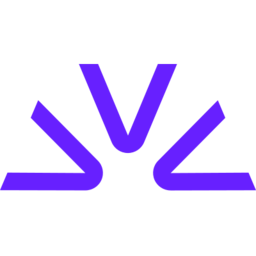

<div align="center">
  

  # 9Router - Router AI GRATIS & Penghemat Token

  **Ngoding tanpa berhenti. Hemat 20-40% token dengan RTK + fallback otomatis ke model AI GRATIS & murah.**

  **Hubungkan semua tool AI coding (Claude Code, Cursor, Antigravity, Copilot, Codex, Gemini, OpenCode, Cline, OpenClaw...) ke 40+ provider AI & 100+ model.**

  [](https://www.npmjs.com/package/9router)
  [](https://www.npmjs.com/package/9router)
  [](https://hub.docker.com/r/decolua/9router)
  [](https://github.com/decolua/9router/pkgs/container/9router)
  [](https://github.com/decolua/9router/blob/main/LICENSE)
<a href="https://trendshift.io/repositories/22628" target="_blank"></a>

[🚀 Mulai Cepat](#-mulai-cepat) • [💡 Fitur](#-fitur-utama) • [📖 Setup](#-panduan-setup) • [🌐 Website](https://9router.com)
[🇧🇷 Português (Brasil)](./README.pt-BR.md) • [🇻🇳 Tiếng Việt](./README.vi.md) • [🇨🇳 中文](./README.zh-CN.md) • [🇯🇵 日本語](./README.ja-JP.md) • [🇷🇺 Русский](./README.ru.md) • [🇹🇭 ไทย](./README.th.md) • [🇮🇷 فارسی](./README.fa_IR.md) • [🇮🇩 Indonesia](./README.id-ID.md) • [🇪🇸 Español](./README.es.md) • [🇫🇷 Français](./README.fr.md)

</div>

---
## 🤔 Kenapa 9Router?

**Berhenti membuang uang dan token serta terus terkena limit:**

- ❌ Kuota langganan kedaluwarsa setiap bulan meski belum terpakai
- ❌ Rate limit menghentikan pekerjaan di tengah ngoding
- ❌ Output tool (`git diff`, `grep`, `ls`...) menghabiskan token dengan cepat
- ❌ API mahal ($20-50/bulan per provider)
- ❌ Harus berpindah provider secara manual

**9Router mengatasinya:**
- ✅ **RTK Token Saver** - Kompres otomatis konten `tool_result`, hemat 20-40% token per request
- ✅ **Maksimalkan langganan** - Lacak kuota dan manfaatkan semuanya sebelum reset
- ✅ **Fallback otomatis** - Langganan → Murah → Gratis, tanpa downtime
- ✅ **Multi-akun** - Round-robin antar akun untuk setiap provider
- ✅ **Universal** - Bekerja dengan Claude Code, Codex, Cursor, Cline, dan tool CLI apa pun

---
## 🔄 Cara Kerja
```
┌─────────────┐
│  Tool CLI   │  (Claude Code, Codex, OpenClaw, Cursor, Cline...)
│    Kamu     │
└──────┬──────┘
       │ http://localhost:20128/v1
       ↓
┌─────────────────────────────────────────────┐
│           9Router (Smart Router)            │
│  • RTK Token Saver (pangkas token tool_result) │
│  • Konversi format (OpenAI ↔ Claude)        │
│  • Pelacakan kuota                          │
│  • Refresh token otomatis                   │
└──────┬──────────────────────────────────────┘
       │
       ├─→ [Tier 1: LANGGANAN] Claude Code, Codex, GitHub Copilot
       │   ↓ kuota habis
       ├─→ [Tier 2: MURAH] GLM ($0.6/1M), MiniMax ($0.2/1M)
       │   ↓ batas budget tercapai
       └─→ [Tier 3: GRATIS] Kiro, OpenCode Free, Vertex (kredit $300)
Hasil: Ngoding tanpa berhenti, biaya minimal + hemat 20-40% token lewat RTK
```

---
## ⚡ Mulai Cepat

**1. Install secara global:**

```bash
npm install -g 9router
9router
```

🎉 Dashboard terbuka di `http://localhost:20128`

**2. Hubungkan provider GRATIS (tanpa perlu daftar):**

Dashboard → Providers → Hubungkan **Kiro AI** (~50 kredit/bulan gratis: Claude 4.5 + GLM-5 + MiniMax) atau **OpenCode Free** (tanpa autentikasi) → Selesai!

**3. Gunakan di tool CLI:**
```
Pengaturan Claude Code/Codex/OpenClaw/Cursor/Cline:
  Endpoint: http://localhost:20128/v1
  API Key: [salin dari dashboard]
  Model: kr/claude-sonnet-4.5
```

**Selesai!** Mulai ngoding dengan model AI GRATIS.

**Alternatif: jalankan dari source (repository ini):**

Paket pada repository ini bersifat privat (`9router-app`), jadi menjalankannya dari source/Docker adalah jalur pengembangan lokal yang diharapkan.

```bash
cp .env.example .env
npm install
PORT=20128 NEXT_PUBLIC_BASE_URL=http://localhost:20128 npm run dev
```
Mode produksi:

```bash
npm run build
PORT=20128 HOSTNAME=0.0.0.0 NEXT_PUBLIC_BASE_URL=http://localhost:20128 npm run start
```

URL bawaan:

- Dashboard: `http://localhost:20128/dashboard`
- API kompatibel OpenAI: `http://localhost:20128/v1`

---
## Panduan Video

<div align="center">
<table>
  <tr>
    <td align="center" width="320">
      <a href="https://www.youtube.com/watch?v=X69n5Lm06Yw">
        
      </a><br/>
      <b>🇻🇳 Tiếng Việt</b><br/>
      <sub>Tiết kiệm chi phí LLM cho OpenClaw với 9Router<br/>oleh <a href="https://www.youtube.com/c/M%C3%ACAIblog">Mì AI</a></sub>
    </td>
    <td align="center" width="320">
      <a href="https://youtu.be/VQAw612S27Y">
        
      </a><br/>
      <b>🇵🇰 اردو / हिन्दी</b><br/>
      <sub>9Router + Claude Code FREE Unlimited Setup<br/>oleh <a href="https://www.youtube.com/@BuildAIWithHamid">Build AI With Hamid</a></sub>
    </td>
    <td align="center" width="320">
      <a href="https://www.youtube.com/watch?v=raEyZPg5xE0">
        
      </a><br/>
      <b>🇺🇸 English</b><br/>
      <sub>9Router + Claude Code FREE Setup<br/>oleh <a href="https://www.youtube.com/@BuildAIWithHamid">Build AI With Hamid</a></sub>
    </td>
    <td align="center" width="320">
      <a href="https://youtu.be/3dF5GIYMrcQ?si=bAyfyiHbARJQAHj_">
        
      </a><br/>
      <b>🇺🇸 English</b><br/>
      <sub>9Router + Claude Code FREE Setup<br/>oleh <a href="https://www.youtube.com/@BuildAIWithHamid">Build AI With Hamid</a></sub>
    </td>
    <td align="center" width="320">
      <a href="https://www.youtube.com/watch?v=o3qYCyjrFYg">
        
      </a><br/>
      <b>🇺🇸 English</b><br/>
      <sub>Claude Code FREE Forever — Unlimited Models<br/>oleh <a href="https://www.youtube.com/@BuildAIWithHamid">Build AI With Hamid</a></sub>
    </td>
  </tr>
  <tr>
    <td align="center" width="320">
      <a href="https://www.youtube.com/watch?v=Ttpc26m39Dw">
        
      </a><br/>
      <b>🇺🇸 English</b><br/>
      <sub>Claude CLI Free Setup with 9Router 🚀<br/>oleh <a href="https://www.youtube.com/@CodeVerseSoban">CodeVerse Soban</a></sub>
    </td>
    <td align="center" width="320">
      <a href="https://www.youtube.com/watch?v=G-5A_D5Pm6Y">
        
      </a><br/>
      <b>🇻🇳 Tiếng Việt</b><br/>
      <sub>Cài Đặt OpenClaw Free Từ A-Z + 9Router<br/>oleh <a href="https://www.youtube.com/@maigia">Mai Gia</a></sub>
    </td>
    <td align="center" width="320">
      <a href="https://www.youtube.com/watch?v=JXmg8_gccgE">
        
      </a><br/>
      <b>🇺🇸 English</b><br/>
      <sub>FREE OpenClaw + Claude Opus 4.6<br/>oleh <a href="https://www.youtube.com/@BuildAIWithHamid">Build AI With Hamid</a></sub>
    </td>
    <td align="center" width="320">
      <a href="https://www.youtube.com/watch?v=CkVZZUSTXAI">
        
      </a><br/>
      <b>🇮🇩 Indonesia</b><br/>
      <sub>Koding 24 Jam Anti Rate Limit! Hemat Token AI 65% | Tutorial Quick Setup 9Router 🚀<br/>oleh <a href="https://www.youtube.com/@krisswuh">Krisswuh</a></sub>
    </td>
    <td align="center" width="320">
      <a href="https://www.youtube.com/watch?v=TXGv4eofe1I">
        
      </a><br/>
      <b>🇮🇩 Indonesia</b><br/>
      <sub>Cara Deploy 9Router di Hugging Face GRATIS Non-Stop! | Alternatif VPS RAM 16GB<br/>oleh <a href="https://www.youtube.com/@krisswuh">Krisswuh</a></sub>
    </td>
  </tr>
  <tr>
    <td align="center" width="320">
      <a href="https://www.youtube.com/watch?v=GyX-DLvePW8">
        
      </a><br/>
      <b>🇮🇷 Persian-فارسی</b><br/>
      <sub dir="rtl">این شکلی از هر API ای استفاده کن برای هوش مصنوعی<br/>by <a href="https://www.youtube.com/@Matin_SenPai">Matin SenPai</a></sub>
    </td>
    <td align="center" width="320">
      <a href="https://www.youtube.com/watch?v=hPusYX-5Pmw">
        
      </a><br/>
      <b>🇻🇳 Tiếng Việt</b><br/>
      <sub>Hướng Dẫn Setup OpenClaw + 9Router: Tạo Bot Zalo AI Tự Động Từ A-Z<br/>oleh <a href="https://github.com/tuanminhhole">tuanminhhole</a></sub>
    </td>
    <td align="center" width="320"></td>
    <td align="center" width="320"></td>
    <td align="center" width="320"></td>
  </tr>
</table>
</div>

> 🎬 **Membuat video tentang 9Router?** Kirim [Pull Request](https://github.com/decolua/9router/pulls) yang menambahkan videomu ke bagian ini — kami akan merge!

---
## 🛠️ Tool CLI yang Didukung

9Router bekerja mulus dengan semua tool AI coding utama:
<div align="center">
  <table>
    <tr>
      <td align="center" width="120">
        <br/>
        <b>Claude-Code</b>
      </td>
      <td align="center" width="120">
        <br/>
        <b>OpenClaw</b>
      </td>
      <td align="center" width="120">
        <br/>
        <b>Codex</b>
      </td>
      <td align="center" width="120">
        <br/>
        <b>OpenCode</b>
      </td>
      <td align="center" width="120">
        <br/>
        <b>Cursor</b>
      </td>
      <td align="center" width="120">
        <br/>
        <b>Antigravity</b>
      </td>
    </tr>
    <tr>
      <td align="center" width="120">
        <br/>
        <b>Cline</b>
      </td>
      <td align="center" width="120">
        <br/>
        <b>Continue</b>
      </td>
      <td align="center" width="120">
        <br/>
        <b>Droid</b>
      </td>
      <td align="center" width="120">
        <br/>
        <b>Roo</b>
      </td>
      <td align="center" width="120">
        <br/>
        <b>Copilot</b>
      </td>
      <td align="center" width="120">
        <br/>
        <b>Kilo Code</b>
      </td>
    </tr>
    <tr>
      <td align="center" width="120">
        <br/>
        <b>OpenDesign</b>
      </td>
      <td align="center" width="120">
        <br/>
        <b>jcode</b>
      </td>
      <td align="center" width="120">
        <br/>
        <b>Grok Build</b>
      </td>
      <td align="center" width="120">
        <br/>
        <b>Devin CLI</b>
      </td>
      <td align="center" width="120">
        <br/>
        <b>DeepSeek TUI</b>
      </td>
      <td align="center" width="120">
        <br/>
        <b>Qwen Code</b>
      </td>
    </tr>
  </table>
</div>
---
## 🌐 Provider yang Didukung
### 🔐 Provider OAuth
<div align="center">
  <table>
    <tr>
      <td align="center" width="120">
        <br/>
        <b>Claude-Code</b>
      </td>
      <td align="center" width="120">
        <br/>
        <b>Antigravity</b>
      </td>
      <td align="center" width="120">
        <br/>
        <b>Codex</b>
      </td>
      <td align="center" width="120">
        <br/>
        <b>GitHub</b>
      </td>
      <td align="center" width="120">
        <br/>
        <b>Cursor</b>
      </td>
      <td align="center" width="120">
        <br/>
        <b>Kimchi</b>
      </td>
    </tr>
  </table>
</div>
### 🆓 Provider Gratis
<div align="center">
  <table>
    <tr>
      <td align="center" width="150">
        <br/>
        <b>Kiro AI</b><br/>
        <sub>Claude 4.5 + GLM-5 + MiniMax<br/>50 kredit/bulan gratis</sub>
      </td>
      <td align="center" width="150">
        <br/>
        <b>OpenCode Free</b><br/>
        <sub>Tanpa autentikasi • Model diambil otomatis<br/>Gratis (daftar model dapat berubah)</sub>
      </td>
      <td align="center" width="150">
        <br/>
        <b>Vertex AI</b><br/>
        <sub>Gemini 3 Pro + GLM-5 + DeepSeek<br/>$300 kredit gratis</sub>
      </td>
    </tr>
  </table>
</div>
> **Catatan:** Free tier iFlow, Qwen Code, dan Gemini CLI dihentikan pada 2026. Gunakan Kiro / OpenCode Free / Vertex sebagai gantinya.
>
> **Kiro AI** beralih ke skema berbayar pada Sep 2025 — free tier kini dibatasi **50 kredit/bulan** (ditambah 500 kredit uji coba untuk akun baru selama 30 hari pertama). Tier berbayar: Pro $20/bulan (1.000 kredit), Pro+ $40/bulan (2.000), Pro Max $100/bulan (5.000), Power $200/bulan (10.000).
> **OpenCode Free** memiliki daftar model yang berubah-ubah dari waktu ke waktu (beberapa model hanya gratis selama promo terbatas) — dapat berubah tanpa pemberitahuan.
> **Vertex AI**: kredit gratis $300 untuk akun GCP baru masih berlaku, tetapi sejak Mar 2026 **endpoint Gemini API tidak lagi menggunakan kredit tersebut** — gunakan endpoint **Vertex AI Studio** sebagai gantinya.
### 🔑 Provider dengan API Key (40+)
<div align="center">
  <table>
    <tr>
      <td align="center" width="100">
        <br/>
        <sub>OpenRouter</sub>
      </td>
      <td align="center" width="100">
        <br/>
        <sub>GLM</sub>
      </td>
      <td align="center" width="100">
        <br/>
        <sub>Kimi</sub>
      </td>
      <td align="center" width="100">
        <br/>
        <sub>MiniMax</sub>
      </td>
      <td align="center" width="100">
        <br/>
        <sub>OpenAI</sub>
      </td>
      <td align="center" width="100">
        <br/>
        <sub>Anthropic</sub>
      </td>
    </tr>
    <tr>
      <td align="center" width="100">
        <br/>
        <sub>Gemini</sub>
      </td>
      <td align="center" width="100">
        <br/>
        <sub>DeepSeek</sub>
      </td>
      <td align="center" width="100">
        <br/>
        <sub>Groq</sub>
      </td>
      <td align="center" width="100">
        <br/>
        <sub>xAI</sub>
      </td>
      <td align="center" width="100">
        <br/>
        <sub>Mistral</sub>
      </td>
      <td align="center" width="100">
        <br/>
        <sub>Perplexity</sub>
      </td>
    </tr>
    <tr>
      <td align="center" width="100">
        <br/>
        <sub>Together AI</sub>
      </td>
      <td align="center" width="100">
        <br/>
        <sub>Fireworks</sub>
      </td>
      <td align="center" width="100">
        <br/>
        <sub>Cerebras</sub>
      </td>
      <td align="center" width="100">
        <br/>
        <sub>Cohere</sub>
      </td>
      <td align="center" width="100">
        <br/>
        <sub>NVIDIA</sub>
      </td>
      <td align="center" width="100">
        <br/>
        <sub>SiliconFlow</sub>
      </td>
    </tr>
  </table>
  <p><i>...dan 20+ provider lain termasuk Nebius, Chutes, Hyperbolic, serta endpoint kustom yang kompatibel dengan OpenAI/Anthropic</i></p>
</div>
### 🏠 Provider Self-hosted

Untuk speech dan embedding yang dijalankan dari mesin **milikmu sendiri** — whisper.cpp,
faster-whisper, Speaches, Kokoro-FastAPI, openedai-speech, llama.cpp/llama-server,
vLLM, Infinity, text-embeddings-inference, atau server lain yang menggunakan format OpenAI.

| Provider | Endpoint yang digunakan | Server umum |
| --- | --- | --- |
| **Self-hosted STT** | `/v1/audio/transcriptions` | whisper.cpp, faster-whisper |
| **Self-hosted TTS** | `/v1/audio/speech` | Kokoro-FastAPI, openedai-speech |
| **Self-hosted Embedding** | `/v1/embeddings` | llama-server, vLLM, Infinity |

Semua provider speech lainnya merupakan layanan cloud dengan endpoint tetap. Ketiga provider ini membaca alamat dari **setiap koneksi**, sehingga satu provider dapat mengarah ke beberapa mesin dan melakukan load balancing seperti provider lainnya.

Atur pada koneksi sebagai `providerSpecificData.baseUrl`:

| Provider | Nilai yang diberikan | Hasil |
| --- | --- | --- |
| Self-hosted STT | URL lengkap — `http://host:8080/v1/audio/transcriptions` | digunakan apa adanya |
| Self-hosted TTS | base URL server — `http://host:8880` | `+ /v1/audio/speech` |
| Self-hosted Embedding | **base URL OpenAI**, termasuk `/v1` — `http://host:8080/v1` | `+ /embeddings` |

> **Perhatikan `/v1` pada embedding.** Adapter menambahkan `/embeddings`, jadi
> `http://host:8080` akan menjadi `http://host:8080/embeddings` dan tidak mengenai
> rute OpenAI — llama-server akan menjawab **501**. Gunakan base URL yang sama seperti
> yang digunakan klien OpenAI. URL lengkap `.../v1/embeddings` juga diterima, sehingga
> nilai yang disalin dari contoh `curl` juga dapat digunakan.

API key tidak diperiksa oleh sebagian besar server lokal, tetapi field tersebut tidak boleh kosong. Field ini diperlukan agar koneksi memiliki entri kredensial tempat `baseUrl` disimpan. Placeholder apa pun dapat digunakan.

Self-hosted Embedding **sengaja tidak memiliki fallback ke cloud** — koneksi yang disimpan tanpa `baseUrl` akan dilaporkan sebagai error konfigurasi, bukan diam-diam fallback ke `api.openai.com`, karena hal itu akan mengirim teks input dan API key ke pihak ketiga melalui provider bernama "Self-hosted".

---
## 💡 Fitur Utama
| Fitur | Fungsinya | Kenapa Penting |
| --- | --- | --- |
| 🚀 **RTK Token Saver** ([RTK](https://github.com/rtk-ai/rtk) ⭐40K) | Mengompres output tool (`git diff`, `grep`, `ls`, `tree`...) sebelum dikirim ke LLM | Hemat **20-40% input token** per request |
| 🧠 **Headroom Token Saver** ([Headroom](https://github.com/chopratejas/headroom)) | Proxy eksternal `/v1/compress` opsional sebelum routing ke provider | Hemat lebih banyak token konteks tanpa mengubah klien |
| 🪨 **Caveman Mode** ([Caveman](https://github.com/JuliusBrussee/caveman) ⭐52K) | Menyuntikkan prompt bergaya caveman → jawaban LLM lebih ringkas, substansi teknis tetap terjaga | Hemat **hingga 65% output token** |
| 🐴 **Ponytail** ([Ponytail](https://github.com/DietrichGebert/ponytail)) | Menyuntikkan prompt "lazy senior dev" → LLM menulis kode minimal dengan prinsip YAGNI (Lite/Full/Ultra) | **Output token lebih sedikit, refactoring lebih sedikit** |
| 🎯 **Smart Fallback 3 Tingkat** | Routing otomatis: Langganan → Murah → Gratis | Ngoding tanpa berhenti, tanpa downtime |
| 📊 **Pelacakan Kuota Real-time** | Jumlah token real-time + hitung mundur reset | Maksimalkan nilai langganan |
| 🔄 **Konversi Format** | OpenAI ↔ Claude ↔ Gemini ↔ Cursor ↔ Kiro ↔ Vertex | Bekerja dengan tool CLI apa pun |
| 👥 **Dukungan Multi-akun** | Beberapa akun per provider | Load balancing + redundansi |
| 🔄 **Refresh Token Otomatis** | Token OAuth di-refresh secara otomatis | Tidak perlu login ulang manual |
| 🎨 **Combo Kustom** | Buat kombinasi model tanpa batas | Sesuaikan fallback dengan kebutuhan |
| 📝 **Log Request** | Mode debug dengan log request/response lengkap | Troubleshooting lebih mudah |
| 💾 **Cloud Sync** | Sinkronkan konfigurasi antar perangkat | Setup yang sama di mana saja |
| 📊 **Analitik Penggunaan** | Lacak token, biaya, dan tren dari waktu ke waktu | Optimalkan pengeluaran |
| 🌐 **Deploy di Mana Saja** | Localhost, VPS, Docker, Cloudflare Workers | Opsi deployment yang fleksibel |

Atur `X-9Router-Token-Saver: off` untuk melewati semua token saver pada satu chat request.

<details>
<summary><b>📖 Detail Fitur</b></summary>

### 🚀 RTK Token Saver

Output tool (`git diff`, `grep`, `find`, `ls`, `tree`, dump log...) sering menghabiskan 30-50% anggaran prompt. RTK mendeteksinya dan menerapkan kompresi cerdas tanpa kehilangan informasi **sebelum** request mencapai LLM:

- **Filter:** `git-diff`, `git-status`, `grep`, `find`, `ls`, `tree`, `dedup-log`, `smart-truncate`, `read-numbered`, `search-list`
- **Deteksi otomatis:** Tidak perlu konfigurasi — RTK memeriksa 1 KB pertama dari setiap `tool_result` dan memilih filter yang tepat.
- **Dirancang aman:** Jika filter gagal, menghasilkan error, atau justru memperbesar output, RTK akan mempertahankan teks asli secara otomatis. Error tidak akan merusak request.
- **Universal:** Bekerja di semua format (OpenAI, Claude, Gemini, Cursor, Kiro, OpenAI Responses) karena dijalankan **sebelum** konversi format apa pun.
- **Aktif secara default:** Dapat dinonaktifkan kapan saja melalui Dashboard → pengaturan endpoint.

```
Tanpa RTK: 47K token dikirim ke LLM
Dengan RTK: 28K token dikirim ke LLM   (hemat 40% · konteks sama · jawaban sama)
```

### 🧠 Headroom Token Saver

Headroom bersifat opsional dan berjalan secara terpisah. 9Router memanggil endpoint lokal `/v1/compress` milik Headroom, lalu tetap menjalankan routing, fallback, autentikasi, dan pelacakan penggunaan seperti biasa:

```
Klien → 9Router → Headroom /v1/compress → 9Router → provider
```

Setup lokal:

```bash
pip install "headroom-ai[proxy]"
headroom proxy --port 8787
```

Aktifkan di Dashboard → Endpoint → Token Saver → Headroom. URL bawaan: `http://localhost:8787`.

Contoh Docker:
```bash
# Layanan Headroom di jaringan Docker yang sama
http://headroom:8787
# Headroom berjalan di mesin host
http://host.docker.internal:8787
```

Jika Headroom tidak tersedia atau mengembalikan error, 9Router menggunakan mekanisme fail-open dan mengirim request asli.

### 🐴 Ponytail (Lazy Senior Dev)

Ponytail menyuntikkan system prompt _"lazy senior dev"_ ke setiap request, sehingga LLM cenderung menghasilkan kode minimal dengan prinsip YAGNI — lebih memilih menghapus daripada menambah, stdlib daripada dependensi baru, dan one-liner daripada abstraksi. Diadaptasi dari [DietrichGebert/ponytail](https://github.com/DietrichGebert/ponytail).

- **Lite** — Kerjakan yang diminta, lalu sebutkan alternatif yang lebih sederhana.
- **Full** — Terapkan urutan YAGNI: stdlib → native → dependensi yang sudah ada → one-liner → kode minimal.
- **Ultra** — YAGNI ekstrem: utamakan penghapusan, kirim one-liner, lalu pertanyakan apakah kebutuhan lainnya benar-benar diperlukan dalam respons yang sama.

```
Tanpa Ponytail: kode verbose, abstraksi tambahan, scaffolding "untuk jaga-jaga"
Dengan Ponytail: diff fungsional terpendek, tanpa abstraksi yang tidak diminta, token lebih sedikit
```

Ponytail tidak pernah mengorbankan validasi input, penanganan error yang mencegah kehilangan data, keamanan, aksesibilitas, atau hal apa pun yang diminta secara eksplisit. Aktifkan di Dashboard → Endpoint → Ponytail. Dapat digunakan bersama Caveman (meringkas output) dan RTK (mengompres input).

### 🎯 Smart Fallback 3 Tingkat

Buat combo dengan fallback otomatis:

```
Combo: "my-coding-stack"
  1. cc/claude-opus-4-6        (langgananmu)
  2. glm/glm-4.7               (backup murah, $0.6/1M)
  3. if/kimi-k2-thinking       (fallback gratis)

→ Otomatis beralih saat kuota habis atau terjadi error
```

### 📊 Pelacakan Kuota Real-time

- Konsumsi token per provider
- Hitung mundur reset (5 jam, harian, mingguan)
- Estimasi biaya untuk tier berbayar
- Laporan pengeluaran bulanan

### 🔄 Konversi Format

Konversi mulus antar format:

- **OpenAI** ↔ **Claude** ↔ **Gemini** ↔ **Cursor** ↔ **Kiro** ↔ **Vertex** ↔ **Antigravity** ↔ **Ollama** ↔ **OpenAI Responses**
- Tool CLI mengirim format OpenAI → 9Router mengonversi → Provider menerima format native
- Bekerja dengan tool apa pun yang mendukung endpoint OpenAI kustom

### 👥 Dukungan Multi-akun

- Tambahkan beberapa akun per provider
- Round-robin otomatis atau routing berbasis prioritas
- Fallback ke akun berikutnya saat satu akun mencapai kuota

### 🔄 Refresh Token Otomatis

- Token OAuth di-refresh otomatis sebelum kedaluwarsa
- Tidak perlu autentikasi ulang manual
- Pengalaman yang mulus di semua provider

### 🎨 Combo Kustom

- Buat kombinasi model tanpa batas
- Campur tier langganan, murah, dan gratis
- Beri nama combo agar mudah diakses
- Bagikan combo antar perangkat dengan Cloud Sync

### 📝 Log Request

- Aktifkan mode debug untuk log request/response lengkap
- Lacak panggilan API, header, dan payload
- Troubleshoot masalah integrasi
- Ekspor log untuk dianalisis

### 💾 Cloud Sync

- Sinkronkan provider, combo, dan pengaturan antar perangkat
- Sinkronisasi latar belakang otomatis
- Penyimpanan terenkripsi yang aman
- Akses setup dari mana saja

#### Catatan Cloud Runtime

- Untuk produksi, utamakan variabel cloud sisi server:
  - `BASE_URL` (URL callback internal yang digunakan scheduler sinkronisasi)
  - `CLOUD_URL` (URL dasar endpoint cloud sync)
- `NEXT_PUBLIC_BASE_URL` dan `NEXT_PUBLIC_CLOUD_URL` masih didukung untuk kompatibilitas/UI, tetapi server runtime sekarang memprioritaskan `BASE_URL`/`CLOUD_URL`.
- Request cloud sync sekarang menggunakan timeout + perilaku fail-fast agar UI tidak menggantung saat DNS/jaringan cloud tidak tersedia.

### 📊 Analitik Penggunaan

- Lacak penggunaan token per provider dan model
- Estimasi biaya dan tren pengeluaran
- Laporan dan insight bulanan
- Optimalkan pengeluaran AI

> **💡 PENTING - Memahami Biaya di Dashboard:**
>
> "Biaya" yang ditampilkan di Analitik Penggunaan **hanya untuk tujuan pelacakan dan perbandingan**.
> 9Router sendiri **tidak pernah menagih** apa pun. Kamu hanya membayar provider secara langsung (jika menggunakan layanan berbayar).
>
> **Contoh:** Jika dashboard menampilkan "$290 total cost" saat menggunakan model gratis Kiro, angka ini menunjukkan
> biaya yang seharusnya dibayar jika memakai API berbayar secara langsung. Biaya sebenarnya = **$0** (free tier Kiro: ~50 kredit/bulan).
>
> Anggap saja sebagai "pelacak penghematan" yang menunjukkan berapa banyak yang kamu hemat dengan memakai model gratis atau
> melakukan routing melalui 9Router!

### 🌐 Deploy di Mana Saja

- 💻 **Localhost** - Bawaan, bekerja offline
- ☁️ **VPS/Cloud** - Bagikan antar perangkat
- 🐳 **Docker** - Deployment dengan satu perintah
- 🚀 **Cloudflare Workers** - Jaringan edge global

</details>

---
## 💰 Ringkasan Harga
| Tier | Provider | Biaya | Reset Kuota | Cocok Untuk |
| --- | --- | --- | --- | --- |
| **🚀 TOKEN SAVER** | **RTK (bawaan)** | **GRATIS** | Selalu aktif | **Hemat 20-40% token pada SETIAP request** |
| **💳 LANGGANAN** | Claude Code (Pro/Max) | $20-200/bulan | 5 jam + mingguan | Sudah berlangganan |
| | Codex (Plus/Pro) | $20-200/bulan | 5 jam + mingguan | Pengguna OpenAI |
| | GitHub Copilot | $10-19/bulan | Bulanan | Pengguna GitHub |
| | Cursor IDE | $20/bulan | Bulanan | Pengguna Cursor |
| **💰 MURAH** | GLM-5.1 / GLM-4.7 | $0.6/1M | Harian pukul 10.00 | Backup hemat |
| | MiniMax M2.7 | $0.2/1M | Periode bergulir 5 jam | Opsi termurah |
| | Kimi K2.5 | $9/bulan tetap | 10M token/bulan | Biaya yang dapat diprediksi |
| **🆓 GRATIS** | Kiro AI | $0 | 50 kredit/bulan | Claude 4.5 + GLM-5 + MiniMax gratis (tier berbayar di atas) |
| | OpenCode Free | $0 | Bervariasi* | Tanpa autentikasi, model diambil otomatis (daftar berubah seiring waktu) |
| | Vertex AI | $300 kredit | Akun GCP baru | Gemini 3 Pro + DeepSeek + GLM-5 (gunakan endpoint Vertex AI Studio untuk kredit gratis) |

**💡 Tips Pro:** Combo RTK + Kiro AI + OpenCode Free = **biaya $0 + hemat 20-40% token**!

---
### 📊 Memahami Biaya & Penagihan 9Router

**Fakta tentang penagihan 9Router:**

✅ **Software 9Router = GRATIS selamanya** (open source, tidak pernah menagih)
✅ **"Biaya" di dashboard = Tampilan/pelacakan saja** (bukan tagihan sebenarnya)
✅ **Kamu membayar provider secara langsung** (langganan atau biaya API)
✅ **Provider GRATIS tetap GRATIS** (Kiro ~50 kredit/bulan, OpenCode Free, Vertex $300 kredit = $0 selama masih dalam batas free tier) — perlu dicatat bahwa free tier iFlow/Qwen/Gemini CLI dihentikan pada 2026
❌ **9Router tidak pernah mengirim invoice** atau menagih kartu kamu

**Cara Kerja Tampilan Biaya:**
Dashboard menampilkan **estimasi biaya** seandainya kamu menggunakan API berbayar secara langsung. Ini **bukan penagihan** - hanya alat perbandingan untuk menunjukkan penghematanmu.

**Contoh Skenario:**

```
Tampilan Dashboard:
• Total Request: 1.662
• Total Token: 47M
• Biaya yang Ditampilkan: $290

Kenyataannya:
• Provider: Kiro (free tier: ~50 kredit/bulan)
• Pembayaran Sebenarnya: $0.00
• Arti $290: Jumlah yang kamu HEMAT dengan memakai model gratis!
```

**Aturan Pembayaran:**
- **Provider langganan** (Claude Code, Codex): Bayar langsung melalui website mereka
- **Provider murah** (GLM, MiniMax): Bayar langsung ke mereka, 9Router hanya melakukan routing
- **Provider GRATIS** (iFlow, Kiro, Qwen): Benar-benar gratis selamanya, tanpa biaya tersembunyi
- **9Router**: Tidak pernah menagih apa pun

---
## 🎯 Skenario Penggunaan

### Kasus 1: "Saya punya langganan Claude Pro"

**Masalah:** Kuota kedaluwarsa tanpa terpakai, terkena rate limit saat ngoding intensif

**Solusi:**

```
Combo: "maximize-claude"
  1. cc/claude-opus-4-7        (maksimalkan pemakaian langganan)
  2. glm/glm-5.1               (backup murah saat kuota habis)
  3. kr/claude-sonnet-4.5      (fallback darurat gratis)

Biaya bulanan: $20 (langganan) + ~$5 (backup) = total $25
vs. $20 + terkena limit = frustrasi
```

### Kasus 2: "Saya ingin biaya nol"

**Masalah:** Tidak mampu membayar langganan, tetapi membutuhkan AI coding yang andal

**Solusi:**

```
Combo: "free-forever"
  1. kr/claude-sonnet-4.5      (Claude 4.5 gratis via Kiro, ~50 kredit/bulan)
  2. kr/glm-5                  (GLM-5 gratis via Kiro)
  3. oc/<auto>                 (OpenCode Free, tanpa autentikasi)

Biaya bulanan: $0
Kualitas: Model siap produksi + RTK menghemat 20-40% token
```

### Kasus 3: "Saya perlu ngoding 24/7 tanpa gangguan"

**Masalah:** Ada deadline dan tidak bisa menoleransi downtime

**Solusi:**

```
Combo: "always-on"
  1. cc/claude-opus-4-7        (kualitas terbaik)
  2. cx/gpt-5.5                (langganan kedua)
  3. glm/glm-5.1               (murah, reset harian)
  4. minimax/MiniMax-M2.7      (termurah, reset 5 jam)
  5. kr/claude-sonnet-4.5      (gratis via Kiro, ~50 kredit/bulan)

Hasil: 5 lapis fallback = tanpa downtime
Biaya bulanan: $20-200 (langganan) + $10-20 (backup)
```

### Kasus 4: "Saya ingin AI GRATIS di OpenClaw"

**Masalah:** Butuh asisten AI di aplikasi pesan (WhatsApp, Telegram, Slack...), sepenuhnya gratis

**Solusi:**

```
Combo: "openclaw-free"
  1. kr/claude-sonnet-4.5      (Claude 4.5 gratis)
  2. kr/glm-5                  (GLM-5 gratis)
  3. kr/MiniMax-M2.5           (MiniMax gratis)

Biaya bulanan: $0
Akses melalui: WhatsApp, Telegram, Slack, Discord, iMessage, Signal...
```

---
## ❓ Pertanyaan yang Sering Diajukan

<details>
<summary><b>📊 Kenapa dashboard saya menampilkan biaya tinggi?</b></summary>

Dashboard melacak penggunaan token dan menampilkan **estimasi biaya** seandainya kamu menggunakan API berbayar secara langsung. Ini **bukan tagihan sebenarnya** - hanya referensi untuk menunjukkan berapa banyak yang kamu hemat dengan menggunakan model gratis atau langganan yang sudah ada melalui 9Router.

**Contoh:**
- **Dashboard menampilkan:** "$290 total cost"
- **Kenyataan:** Kamu memakai model gratis Kiro (~50 kredit/bulan)
- **Biaya sebenarnya:** **$0.00**
- **Arti $290:** Jumlah yang kamu **hemat** dengan memakai model gratis alih-alih API berbayar!

Tampilan biaya berfungsi sebagai "pelacak penghematan" untuk membantu memahami pola penggunaan dan peluang optimasi.

</details>

<details>
<summary><b>💳 Apakah saya akan ditagih oleh 9Router?</b></summary>

**Tidak.** 9Router adalah software gratis dan open source yang berjalan di komputermu sendiri. 9Router tidak pernah menagih apa pun.

**Kamu hanya membayar:**

- ✅ **Provider langganan** (Claude Code $20/bulan, Codex $20-200/bulan) → Bayar langsung melalui website mereka
- ✅ **Provider murah** (GLM, MiniMax) → Bayar langsung ke mereka, 9Router hanya melakukan routing request
- ❌ **9Router sendiri** → **Tidak pernah menagih apa pun**

9Router adalah proxy/router lokal. 9Router tidak menyimpan kartu kreditmu, tidak dapat mengirim invoice, dan tidak memiliki sistem penagihan. Software ini sepenuhnya gratis.

</details>

<details>
<summary><b>🆓 Apakah provider GRATIS benar-benar tanpa batas?</b></summary>

**Sebagian besar, ya.** Provider GRATIS saat ini (Kiro, OpenCode Free, Vertex) memang gratis, tetapi free tier memiliki batas:

Layanan gratis ini diberikan oleh masing-masing perusahaan:
- **Kiro AI**: ~50 kredit/bulan gratis (ditambah 500 kredit uji coba untuk akun baru selama 30 hari pertama) melalui AWS Builder ID / Google / GitHub OAuth. Tier berbayar tersedia setelah batas tersebut.
- **OpenCode Free**: Passthrough proxy tanpa autentikasi, model diambil otomatis dari `opencode.ai/zen/v1/models`. Daftar model gratis berubah-ubah dari waktu ke waktu (beberapa model hanya gratis selama promo terbatas) — dapat berubah tanpa pemberitahuan.
- **Vertex AI**: Kredit gratis $300 untuk akun Google Cloud baru (90 hari). Sejak Mar 2026 endpoint Gemini API tidak lagi menggunakan kredit ini — gunakan endpoint **Vertex AI Studio** sebagai gantinya.

9Router hanya melakukan routing request ke layanan tersebut - tidak ada "jebakan" atau penagihan di masa depan dari 9Router sendiri. Layanan itu memang gratis, dan 9Router membuatnya lebih mudah digunakan dengan dukungan fallback.

**Free tier yang dihentikan (tidak lagi direkomendasikan):**
- ❌ **iFlow**: Sebelumnya gratis tanpa batas, kini berubah menjadi berbayar (2026)
- ❌ **Qwen Code**: Free tier OAuth dihentikan sepenuhnya oleh Alibaba pada 2026-04-15
- ❌ **Gemini CLI**: Layanan dihentikan sepenuhnya oleh Google pada 2026-06-18 (digantikan oleh Antigravity CLI yang closed source). Dihentikan — jangan digunakan.

</details>

<details>
<summary><b>💰 Bagaimana cara meminimalkan biaya AI yang benar-benar saya bayar?</b></summary>

**Strategi Utamakan Gratis:**

1. **Mulai dengan combo 100% gratis:**
   ```
   1. kr/glm-5 (GLM-5 gratis via Kiro, ~50 kredit/bulan)
   2. Model OpenCode Free (tanpa autentikasi, diambil otomatis)
   3. Vertex AI Gemini 3 Pro (menggunakan endpoint Vertex AI Studio dengan kredit $300)
   ```

   **Biaya: $0/bulan** (selama masih dalam batas kredit gratis Kiro; OpenCode/Vertex mengikuti batas free tier masing-masing)

2. **Tambahkan backup murah** hanya jika diperlukan:

   ```
   4. glm/glm-4.7 ($0.6/1M token)
   ```

   **Biaya tambahan: Hanya bayar sesuai yang benar-benar digunakan**
3. **Gunakan provider langganan terakhir:**
   - Hanya jika kamu sudah memilikinya
   - 9Router membantu memaksimalkan nilainya melalui pelacakan kuota

**Hasil:** Sebagian besar pengguna dapat beroperasi dengan $0/bulan hanya menggunakan free tier!

</details>

<details>
<summary><b>📈 Bagaimana jika penggunaan saya tiba-tiba melonjak?</b></summary>

Smart fallback 9Router mencegah tagihan tak terduga:

**Skenario:** Kamu sedang ngoding intensif dan menghabiskan kuota

**Tanpa 9Router:**
- ❌ Terkena rate limit → Pekerjaan berhenti → Frustrasi
- ❌ Atau: Tanpa sengaja membuat tagihan API membengkak

**Dengan 9Router:**

- ✅ Langganan mencapai limit → Otomatis fallback ke tier murah
- ✅ Biaya tier murah mulai meningkat → Otomatis fallback ke tier gratis
- ✅ Ngoding tanpa berhenti → Biaya dapat diprediksi

**Kamu yang memegang kendali:** Atur batas pengeluaran per provider di dashboard, dan 9Router akan mematuhi batas tersebut.

</details>

---
## 📖 Panduan Setup

<details>
<summary><b>🔐 Provider Langganan (Maksimalkan Nilainya)</b></summary>

### Claude Code (Pro/Max)

```bash
Dashboard → Providers → Hubungkan Claude Code
→ Login OAuth → Refresh token otomatis
→ Pelacakan kuota 5 jam + mingguan

Model:
  cc/claude-opus-4-7
  cc/claude-opus-4-6
  cc/claude-sonnet-4-6
  cc/claude-haiku-4-5-20251001
```

**Tips Pro:** Gunakan Opus untuk tugas kompleks, Sonnet untuk kecepatan. 9Router melacak kuota per model!

### OpenAI Codex (Plus/Pro)

```bash
Dashboard → Providers → Hubungkan Codex
→ Login OAuth (port 1455)
→ Reset 5 jam + mingguan

Model:
  cx/gpt-5.5
  cx/gpt-5.4
  cx/gpt-5.3-codex
  cx/gpt-5.2-codex
```

### GitHub Copilot

```bash
Dashboard → Providers → Hubungkan GitHub
→ OAuth melalui GitHub
→ Reset bulanan (tanggal 1 setiap bulan)

Model:
  gh/gpt-5.4
  gh/claude-opus-4.7
  gh/claude-sonnet-4.6
  gh/gemini-3.1-pro-preview
  gh/grok-code-fast-1
```

### Cursor IDE

```bash
Dashboard → Providers → Hubungkan Cursor
→ Login OAuth
→ Langganan bulanan

Model:
  cu/claude-4.6-opus-max
  cu/claude-4.5-sonnet-thinking
  cu/gpt-5.3-codex
```

</details>

<details>
<summary><b>💰 Provider Murah (Backup)</b></summary>

### GLM-5.1 / GLM-4.7 (Reset harian, $0.6/1M)

1. Daftar: [Zhipu AI](https://open.bigmodel.cn/)
2. Ambil API key dari Coding Plan
3. Dashboard → Tambahkan API Key:
   - Provider: `glm`
   - API Key: `your-key`

**Gunakan:** `glm/glm-5.1`, `glm/glm-5`, `glm/glm-4.7`

**Tips Pro:** Coding Plan menawarkan kuota 3× dengan biaya 1/7! Reset setiap hari pukul 10.00.

### MiniMax M2.7 (Reset 5 jam, $0.20/1M)

1. Daftar: [MiniMax](https://www.minimax.io/)
2. Ambil API key
3. Dashboard → Tambahkan API Key

**Gunakan:** `minimax/MiniMax-M2.7`, `minimax/MiniMax-M2.5`

**Tips Pro:** Opsi termurah untuk konteks panjang (1M token)!

### Kimi K2.5 ($9/bulan tetap)

1. Berlangganan: [Moonshot AI](https://platform.moonshot.ai/)
2. Ambil API key
3. Dashboard → Tambahkan API Key

**Gunakan:** `kimi/kimi-k2.5`, `kimi/kimi-k2.5-thinking`

**Tips Pro:** Tarif tetap $9/bulan untuk 10M token = biaya efektif $0.90/1M!

</details>

<details>
<summary><b>🆓 Provider GRATIS (Direkomendasikan)</b></summary>

### Kiro AI (Claude 4.5 + GLM-5 + MiniMax GRATIS)

```bash
Dashboard → Hubungkan Kiro
→ AWS Builder ID, AWS IAM Identity Center, Google, atau GitHub
→ Penggunaan tanpa batas

Model:
  kr/claude-sonnet-4.5
  kr/claude-haiku-4.5
  kr/glm-5
  kr/MiniMax-M2.5
  kr/qwen3-coder-next
  kr/deepseek-3.2
```

**Tips Pro:** Opsi gratis terbaik untuk Claude. Tanpa API key, tanpa pembayaran, sepenuhnya tanpa batas.

### OpenCode Free (Tanpa autentikasi, model diambil otomatis)

```bash
Dashboard → Hubungkan OpenCode Free
→ Tidak perlu login (passthrough proxy)
→ Model diambil otomatis dari opencode.ai/zen/v1/models
```

**Tips Pro:** Setup paling cepat. Cukup hubungkan dan mulai ngoding.

### Vertex AI (Kredit gratis $300 untuk akun GCP baru)

```bash
Dashboard → Hubungkan Vertex AI
→ Upload file JSON Google Cloud Service Account
→ Aktifkan Vertex AI API di proyek GCP

Model:
  vertex/gemini-3.1-pro-preview
  vertex/gemini-3-flash-preview
  vertex/gemini-2.5-flash

Vertex Partner (Anthropic / DeepSeek / GLM / Qwen melalui Vertex):
  vertex-partner/glm-5-maas
  vertex-partner/deepseek-v3.2-maas
  vertex-partner/qwen3-next-80b-a3b-thinking-maas
```

**Tips Pro:** Akun Google Cloud baru mendapatkan kredit gratis $300 selama 90 hari. Cukup banyak untuk ngoding sehari-hari.

</details>

<details>
<summary><b>🎨 Membuat Combo</b></summary>

### Contoh 1: Maksimalkan Langganan → Backup Murah

```
Dashboard → Combos → Buat Baru

Nama: premium-coding
Model:
  1. cc/claude-opus-4-7 (langganan utama)
  2. glm/glm-5.1 (backup murah, $0.6/1M)
  3. minimax/MiniMax-M2.7 (fallback termurah, $0.20/1M)

Gunakan di CLI: premium-coding

Contoh biaya bulanan (100M token):
  80M melalui Claude (langganan): tambahan $0
  15M melalui GLM: $9
  5M melalui MiniMax: $1
  Total: $10 + langgananmu
```

### Contoh 2: Hanya Gratis (Biaya Nol)

```
Nama: free-combo
Model:
  1. kr/claude-sonnet-4.5 (Claude 4.5 gratis via Kiro, ~50 kredit/bulan)
  2. kr/glm-5 (GLM-5 gratis via Kiro)
  3. vertex/gemini-3.1-pro-preview ($300 kredit gratis)

Biaya: $0 selamanya (+ hemat 20-40% token lewat RTK)!
```

</details>

<details>
<summary><b>🔧 Integrasi CLI</b></summary>

### Cursor IDE

```
Settings → Models → Advanced:
  OpenAI API Base URL: http://localhost:20128/v1
  OpenAI API Key: [dari dashboard 9Router]
  Model: cc/claude-opus-4-7
```

Atau gunakan combo: `premium-coding`

### Claude Code

Edit `~/.claude/config.json`:

```json
{
  "anthropic_api_base": "http://localhost:20128/v1",
  "anthropic_api_key": "your-9router-api-key"
}
```

### Codex CLI

```bash
export OPENAI_BASE_URL="http://localhost:20128"
export OPENAI_API_KEY="your-9router-api-key"

codex "your prompt"
```

### OpenClaw

**Opsi 1 — Dashboard (direkomendasikan):**

```
Dashboard → CLI Tools → OpenClaw → Select Model → Apply
```

**Opsi 2 — Manual:** Edit `~/.openclaw/openclaw.json`:
```json
{
  "agents": {
    "defaults": {
      "model": {
        "primary": "9router/kr/claude-sonnet-4.5"
      }
    }
  },
  "models": {
    "providers": {
      "9router": {
        "baseUrl": "http://127.0.0.1:20128/v1",
        "apiKey": "sk_9router",
        "api": "openai-completions",
        "models": [
          {
            "id": "kr/claude-sonnet-4.5",
            "name": "Claude Sonnet 4.5 (Kiro Free)"
          }
        ]
      }
    }
  }
}
```

> **Catatan:** OpenClaw hanya bekerja dengan 9Router lokal. Gunakan `127.0.0.1` alih-alih `localhost` untuk menghindari masalah resolusi IPv6.

### Cline / Continue / RooCode

```
Provider: OpenAI Compatible
Base URL: http://localhost:20128/v1
API Key: [dari dashboard]
Model: cc/claude-opus-4-7
```

</details>

<details>
<summary><b>🚀 Deployment</b></summary>

### Deployment VPS

```bash
# Clone dan install
git clone https://github.com/decolua/9router.git
cd 9router
npm install
npm run build
# Konfigurasi
export JWT_SECRET="your-secure-secret-change-this"
export INITIAL_PASSWORD="your-password"
export DATA_DIR="/var/lib/9router"
export PORT="20128"
export HOSTNAME="0.0.0.0"
export NODE_ENV="production"
export NEXT_PUBLIC_BASE_URL="http://localhost:20128"
export NEXT_PUBLIC_CLOUD_URL="https://9router.com"
export API_KEY_SECRET="endpoint-proxy-api-key-secret"
export MACHINE_ID_SALT="endpoint-proxy-salt"

# Jalankan
npm run start
# Atau gunakan PM2
npm install -g pm2
pm2 start npm --name 9router -- start
pm2 save
pm2 startup
```

### Docker

Image yang dipublikasikan (multi-platform `linux/amd64` + `linux/arm64`):

- Docker Hub: [`decolua/9router`](https://hub.docker.com/r/decolua/9router)
- GHCR: [`ghcr.io/decolua/9router`](https://github.com/decolua/9router/pkgs/container/9router)

**Mulai cepat (gunakan image yang dipublikasikan):**

```bash
docker run -d \
  --name 9router \
  -p 20128:20128 \
  -v "$HOME/.9router:/app/data" \
  -e DATA_DIR=/app/data \
  decolua/9router:latest
```

→ Buka http://localhost:20128

**Build dari source (dev):**
```bash
git clone https://github.com/decolua/9router.git
cd 9router/app
docker build -t 9router .
docker run -d --name 9router -p 20128:20128 \
  -v "$HOME/.9router:/app/data" -e DATA_DIR=/app/data 9router
```

**Konfigurasi bawaan container:**

- `PORT=20128`
- `HOSTNAME=0.0.0.0`

**Perintah berguna:**

```bash
docker logs -f 9router
docker restart 9router
docker stop 9router && docker rm 9router
docker pull decolua/9router:latest   # update ke versi terbaru
```

**Persistensi data:** `$HOME/.9router/db/data.sqlite` di host ↔ `/app/data/db/data.sqlite` di container.

### Environment Variables
| Variabel | Default | Deskripsi |
| --- | --- | --- |
| `JWT_SECRET` | Dibuat otomatis (`~/.9router/jwt-secret`) | Secret untuk menandatangani JWT pada cookie autentikasi dashboard (override agar dapat dibagikan antar instance) |
| `INITIAL_PASSWORD` | `123456` | Password login pertama jika belum ada hash yang tersimpan |
| `DATA_DIR` | `~/.9router` | Lokasi data utama aplikasi (SQLite di `$DATA_DIR/db/data.sqlite`) |
| `PORT` | bawaan framework | Port service (`20128` pada contoh) |
| `HOSTNAME` | bawaan framework | Host untuk bind (Docker menggunakan `0.0.0.0` secara default) |
| `NODE_ENV` | bawaan runtime | Atur ke `production` untuk deployment |
| `BASE_URL` | `http://localhost:20128` | Base URL internal sisi server yang digunakan proses cloud sync |
| `CLOUD_URL` | `https://9router.com` | Base URL endpoint cloud sync sisi server |
| `NEXT_PUBLIC_BASE_URL` | `http://localhost:3000` | Base URL publik untuk kompatibilitas dengan versi lama (utamakan `BASE_URL` untuk server runtime) |
| `NEXT_PUBLIC_CLOUD_URL` | `https://9router.com` | URL cloud publik untuk kompatibilitas dengan versi lama (utamakan `CLOUD_URL` untuk server runtime) |
| `API_KEY_SECRET` | `endpoint-proxy-api-key-secret` | Secret HMAC untuk API key yang dibuat |
| `MACHINE_ID_SALT` | `endpoint-proxy-salt` | Salt untuk menghasilkan hash machine ID yang stabil |
| `ENABLE_REQUEST_LOGS` | `false` | Mengaktifkan log request/response di bawah `logs/` |
| `AUTH_COOKIE_SECURE` | `false` | Memaksa cookie autentikasi `Secure` (atur `true` di belakang reverse proxy HTTPS) |
| `REQUIRE_API_KEY` | `false` | Mewajibkan Bearer API key pada rute `/v1/*` (direkomendasikan untuk deployment yang terekspos internet) |
| `HTTP_PROXY`, `HTTPS_PROXY`, `ALL_PROXY`, `NO_PROXY` | kosong | Proxy outbound opsional untuk panggilan ke provider upstream |
| `SEARXNG_URL` | `http://localhost:8888/search` | Endpoint untuk provider web search SearXNG bawaan tanpa autentikasi |

Catatan:

- Variabel proxy huruf kecil juga didukung: `http_proxy`, `https_proxy`, `all_proxy`, `no_proxy`.
- `.env` tidak dimasukkan ke dalam Docker image (`.dockerignore`); masukkan konfigurasi runtime dengan `--env-file` atau `-e`.
- Di Windows, `APPDATA` dapat digunakan untuk resolusi path penyimpanan lokal.
- `INSTANCE_NAME` muncul di dokumentasi/template env lama, tetapi saat ini tidak digunakan pada runtime.

### File Runtime dan Penyimpanan

- State utama aplikasi: `${DATA_DIR}/db/data.sqlite` (SQLite — provider, combo, alias, key, pengaturan, riwayat penggunaan)
- Backup otomatis: `${DATA_DIR}/db/backups/`
- Log request/translator opsional: `<repo>/logs/...` saat `ENABLE_REQUEST_LOGS=true`
- `${DATA_DIR}` dan `~/.9router` mengarah ke lokasi yang sama di container Docker — symlink `/root/.9router -> /app/data` dibuat saat build.

</details>

---
## 📊 Model yang Tersedia

<details>
<summary><b>Lihat semua model yang tersedia</b></summary>

**Claude Code (`cc/`)** - Pro/Max:

- `cc/claude-opus-4-7`
- `cc/claude-opus-4-6`
- `cc/claude-sonnet-4-6`
- `cc/claude-sonnet-4-5-20250929`
- `cc/claude-haiku-4-5-20251001`

**Codex (`cx/`)** - Plus/Pro:

- `cx/gpt-5.5`
- `cx/gpt-5.4`
- `cx/gpt-5.3-codex`
- `cx/gpt-5.2-codex`
- `cx/gpt-5.1-codex-max`

**GitHub Copilot (`gh/`)**:
- `gh/gpt-5.4`
- `gh/claude-opus-4.7`
- `gh/claude-sonnet-4.6`
- `gh/gemini-3.1-pro-preview`
- `gh/grok-code-fast-1`

**Cursor (`cu/`)** - Langganan:

- `cu/claude-4.6-opus-max`
- `cu/claude-4.5-sonnet-thinking`
- `cu/gpt-5.3-codex`
- `cu/kimi-k2.5`

**GLM (`glm/`)** - $0.6/1M:

- `glm/glm-5.1`
- `glm/glm-5`
- `glm/glm-4.7`

**MiniMax (`minimax/`)** - $0.2/1M:

- `minimax/MiniMax-M2.7`
- `minimax/MiniMax-M2.5`

**Kimi (`kimi/`)** - $9/bulan tetap:

- `kimi/kimi-k2.5`
- `kimi/kimi-k2.5-thinking`

**Kiro (`kr/`)** - Gratis (~50 kredit/bulan, tier berbayar di atas):

- `kr/claude-sonnet-4.5`
- `kr/claude-haiku-4.5`
- `kr/glm-5`
- `kr/MiniMax-M2.5`
- `kr/qwen3-coder-next`
- `kr/deepseek-3.2`

**OpenCode Free (`oc/`)** - GRATIS tanpa autentikasi:

- Diambil otomatis dari `opencode.ai/zen/v1/models`

**Vertex AI (`vertex/`)** - $300 kredit gratis:

- `vertex/gemini-3.1-pro-preview`
- `vertex/gemini-3-flash-preview`
- `vertex/gemini-2.5-flash`
- `vertex-partner/glm-5-maas`
- `vertex-partner/deepseek-v3.2-maas`

</details>

---
## 🐛 Pemecahan Masalah

**"Language model did not provide messages"**

- Kuota provider habis → Cek pelacak kuota di dashboard
- Solusi: Gunakan combo fallback atau beralih ke tier yang lebih murah

**Rate limiting**

- Kuota langganan habis → Fallback ke GLM/MiniMax
- Tambahkan combo: `cc/claude-opus-4-7 → glm/glm-5.1 → kr/claude-sonnet-4.5`

**Token OAuth kedaluwarsa**

- Di-refresh otomatis oleh 9Router
- Jika masalah berlanjut: Dashboard → Provider → Hubungkan ulang

**Biaya tinggi**

- Aktifkan RTK di Dashboard → pengaturan endpoint (default AKTIF, menghemat 20-40% token)
- Cek statistik penggunaan di Dashboard
- Ganti model utama ke GLM/MiniMax
- Gunakan free tier (Kiro, OpenCode Free, Vertex) untuk tugas yang tidak kritis

**Dashboard terbuka di port yang salah**

- Atur `PORT=20128` dan `NEXT_PUBLIC_BASE_URL=http://localhost:20128`

**Login pertama tidak berfungsi**

- Cek `INITIAL_PASSWORD` di `.env`
- Jika tidak diatur, password fallback adalah `123456`

**Tidak ada log request di `logs/`**

- Atur `ENABLE_REQUEST_LOGS=true`

---
## 🛠️ Tech Stack

- **Runtime**: Node.js 20+
- **Framework**: Next.js 16
- **UI**: React 19 + Tailwind CSS 4
- **Database**: SQLite (better-sqlite3 / node:sqlite / fallback sql.js)
- **Streaming**: Server-Sent Events (SSE)
- **Autentikasi**: OAuth 2.0 (PKCE) + JWT + API Key

---

## 📝 Referensi API
### Chat Completions

```bash
POST http://localhost:20128/v1/chat/completions
Authorization: Bearer your-api-key
Content-Type: application/json

{
  "model": "cc/claude-opus-4-6",
  "messages": [
    {"role": "user", "content": "Write a function to..."}
  ],
  "stream": true
}
```

### Daftar Model

```bash
GET http://localhost:20128/v1/models
Authorization: Bearer your-api-key

→ Mengembalikan semua model + combo dalam format OpenAI
```

## 📧 Dukungan

- **Website**: [9router.com](https://9router.com)
- **GitHub**: [github.com/decolua/9router](https://github.com/decolua/9router)
- **Issues**: [github.com/decolua/9router/issues](https://github.com/decolua/9router/issues)

---

## 👥 Kontributor

Terima kasih kepada semua kontributor yang membantu membuat 9Router semakin baik!

[](https://github.com/decolua/9router/graphs/contributors)

---
## 📊 Star Chart

[](https://starchart.cc/decolua/9router)

## 🔀 Fork

**[OmniRoute](https://github.com/diegosouzapw/OmniRoute)** — Fork 9Router berbasis TypeScript dengan fitur lengkap. Menambahkan 36+ provider, auto-fallback 4 tingkat, API multimodal (image, embedding, audio, TTS), circuit breaker, semantic cache, evaluasi LLM, dan dashboard yang lebih matang. Memiliki 368+ unit test. Tersedia melalui npm dan Docker.

---
## 🙏 Ucapan Terima Kasih

Dibangun di atas karya proyek-proyek hebat:
- **[CLIProxyAPI](https://github.com/router-for-me/CLIProxyAPI)** — implementasi Go asli yang menginspirasi port JavaScript ini.
- **[RTK](https://github.com/rtk-ai/rtk)**  — token saver berbasis Rust. 9Router mem-port pipeline kompresinya ke JS → **−20-40% input token** pada setiap request.
- **[Caveman](https://github.com/JuliusBrussee/caveman)**  oleh **[@JuliusBrussee](https://github.com/JuliusBrussee)** — konsep viral _"why use many token when few token do trick"_. 9Router mengadaptasi prompt-nya → **−65% output token**.
- **[Ponytail](https://github.com/DietrichGebert/ponytail)**  oleh **[@DietrichGebert](https://github.com/DietrichGebert)** — skill _"lazy senior dev"_. 9Router menerapkan urutan prioritas YAGNI-first → **token lebih sedikit, kode lebih sedikit, diff lebih pendek**.

Terima kasih sebesar-besarnya kepada para pembuat proyek tersebut — tanpa karya mereka, fitur penghemat token 9Router tidak akan ada. Beri mereka ⭐ di GitHub!

---
## 📄 Lisensi

Lisensi MIT - lihat [LICENSE](../LICENSE) untuk detailnya.

---

<div align="center">
  <sub>Dibuat dengan ❤️ untuk developer yang ngoding 24/7</sub>
</div>
