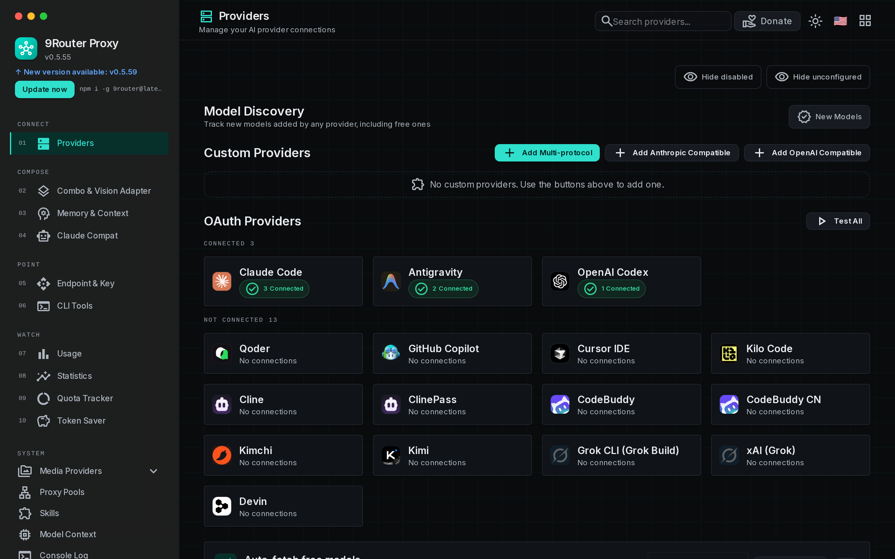

# 9Router

> นี่คือบทสรุปฉบับแปลแบบสั้น เอกสารฉบับหลักเป็นภาษาอังกฤษ ดูได้ที่
> [README.md](../README.md) และ [docs/README.md](../docs/README.md)

9Router คือเกตเวย์กำหนดเส้นทางงาน AI ที่ทำงานบนเครื่องของคุณเอง พร้อมแดชบอร์ด
มันเปิดปลายทางเดียวที่เข้ากันได้กับ OpenAI ที่ `/v1/*` แปลงทุกคำขอให้เป็นรูปแบบ
ที่ผู้ให้บริการที่เลือกไว้ต้องการ และสลับทั้งระหว่างโมเดลและระหว่างบัญชี
การตั้งค่าฝั่งไคลเอนต์ชุดเดียวจึงยังใช้งานได้ต่อ แม้ผู้ให้บริการรายหนึ่ง
จะใช้โควตาหมด ถูกจำกัดอัตราการเรียก หรือล่มไป

<p align="center">
  
</p>

## การติดตั้ง

```bash
npm install -g 9router
9router
```

แดชบอร์ดอยู่ที่ `http://localhost:20128/dashboard` และ API ที่เข้ากันได้กับ
OpenAI อยู่ที่ `http://localhost:20128/v1` การเข้าสู่ระบบครั้งแรกใช้ค่า
`INITIAL_PASSWORD` ซึ่งมีค่าเริ่มต้นเป็น `123456` โปรดเปลี่ยนค่านี้

ขั้นตอนฉบับเต็มอยู่ใน
[docs/getting-started.md](../docs/getting-started.md)

## สถานะของ fork

ที่เก็บโค้ดนี้เป็น fork ที่ดูแลรักษาอย่างเป็นอิสระจาก
[decolua/9router](https://github.com/decolua/9router) โดยติดตามโครงการต้นทาง
ไปพร้อมกับนำการแก้ไขและการผนวกรวมของตนเองเข้ามาตามกำหนดเวลาของตัวเอง ชื่อ
9Router ประวัติของโครงการต้นทาง สัญญาอนุญาต และการให้เครดิตผู้เขียน
ยังคงถูกรักษาไว้ทั้งหมด

โครงการต้นทางเป็นเพียงแหล่งอ้างอิงแบบอ่านอย่างเดียว งานพัฒนาทั้งหมดเกิดขึ้นที่นี่
fork นี้ไม่ได้รับการรับรองจากโครงการต้นทาง และไม่ได้พูดแทนโครงการต้นทาง

ข้อความฉบับเต็มรวมถึงกระบวนการซิงก์ อยู่ในหัวข้อ "Fork status" ของ
[README.md](../README.md) ภาษาอังกฤษ

## เอกสาร

- [README.md](../README.md) หน้าหลักภาษาอังกฤษ
- [docs/README.md](../docs/README.md) สารบัญเอกสาร

## สัญญาอนุญาต

MIT ดูที่ [LICENSE](../LICENSE)
